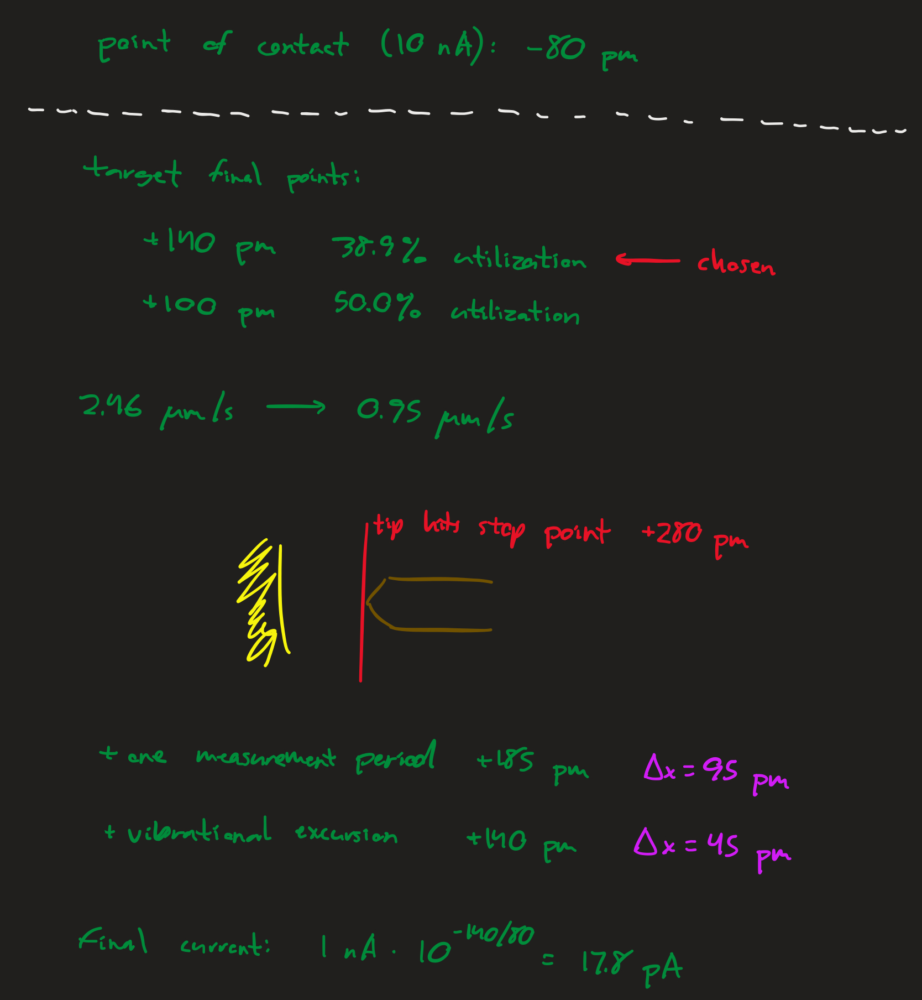
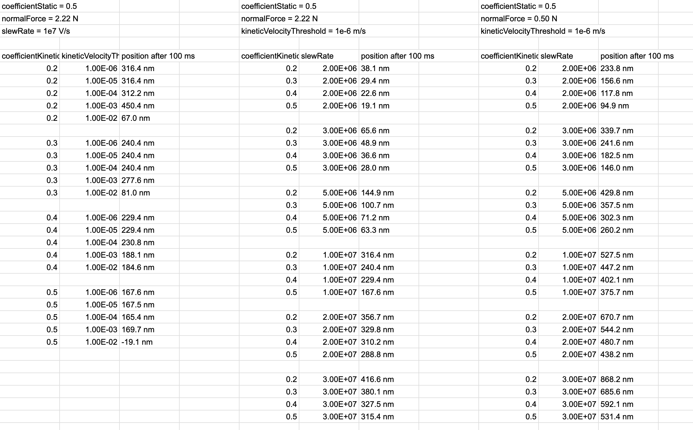
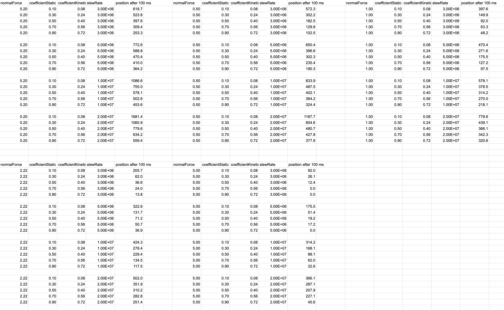
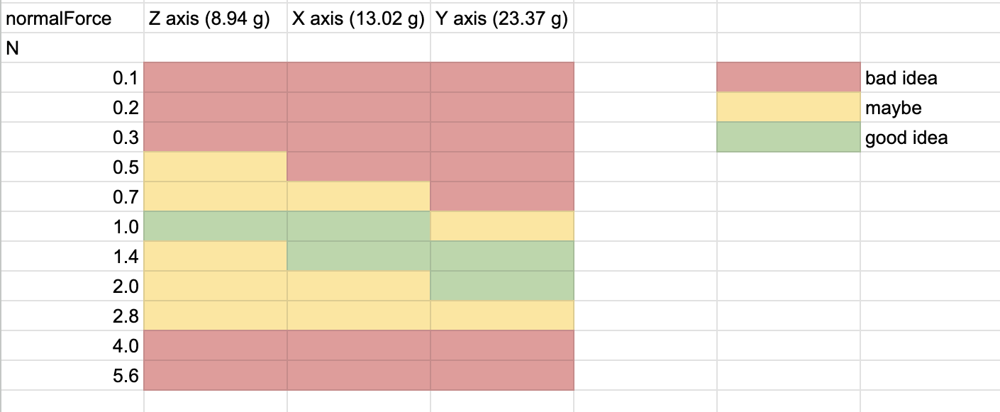

# Capacitive Displacement Metrology

Phase 0.2 of the [APM Roadmap](https://github.com/philipturner/apm-roadmap)

Objective: Finish education in basic mechanical engineering and epoxy handling.

Deadline: March 31, 2026 for the first physical prototype

Table of Contents:
- [December 15, 2025](#december-15-2025)
- [December 16, 2025](#december-16-2025)
- [December 18, 2025](#december-18-2025)
- [December 22, 2025](#december-22-2025)
- [January 3, 2026](#january-3-2026)
- [January 5, 2026](#january-5-2026)
- [January 6, 2026](#january-6-2026)
- [January 7, 2026](#january-7-2026)
- [January 8, 2026](#january-8-2026)
- [January 9, 2026](#january-9-2026)
- [January 12, 2026](#january-12-2026)

## December 15, 2025

$80,000 worth of wire transfers have hit the bank. I now have enough financial security to proceed with hardware work.

The first step is ensuring I can be paid a full-time salary. Comply with US tax laws, SEC regulations, etc. I predicted the exact numbers before going through the legal boilerplate and setup.

To save effort, serious work <i>probably</i> won't begin until Jan 2 2026. I can avoid filing a few tax return documents for the 2025 year. I will figure out some remaining tax and paperwork stuff during the last days of 2025.

Current estimate for the press release is Dec 18 2025.

## December 16, 2025

This is ridiculous. The United States is the only country where taxes are such a pain: https://www.propublica.org/article/inside-turbotax-20-year-fight-to-stop-americans-from-filing-their-taxes-for-free

## December 18, 2025

I want to make the creepless SPM happen in the shortest amount of time, and publish transparent data that can be fact-checked. To stay true to my motive, I made another attempt to persuade Robert Wolkow to cooperate. I could save many person-hours, recycling existing designs for creepless SPM hardware.

Regardless of whether he shares any design information, I will proceed according to plan. Any data published by other sources should be treated with extreme skepticism. Do not trust any other lab's data, except data gathered in my own house.

| Phase | Description | Voltage |
| ----: | ----------- | ------: |
| 0.2   | PZT metrology | 24&ndash;40 V |
| 1.1   | LiNbO3 metrology | 850 V |
| 1.2   | LiNbO3 kinematic mount | 850 V |
| 2.1   | LiNbO3 STM, graphite sample | 850 V |
| 2.2   | LiNbO3 STM, inverted mode tip registration | 850 V |

I can shortcut to an important milestone, without the expensive vacuum chamber. Just need to speed up the progress with tripod synthesis. No additional employees or contractors needed for hardware design.

At the end of Phase 0.2, we'll reflect on how long this phase took. If it happened quickly, we can reach the end goal with a single employee. Otherwise, I will probably hire a temporary contractor for hardware design. Phase 2.2 should be completed before Dec 31 2026.

> Nomenclature change: exclude Roman numerals from the phase names, at least when numbering sub-phases. It's highly cumbersome to process "I.1" and "II.2", versus "1.1" and "2.2".
>
> In addition, we may right-align the phase names in tables and spreadsheets.

## December 22, 2025

Still figuring out taxes, but making progress. Putting work on the next MNT animation on hold. Not really motivated when the response to the tutorial is anemic.

Figuring out the details of a possible contract with ChimiaDAO. Our funds should last us well beyond 6 months into the future: oversee completion of Phase 0.2, stable income while raising funds for the next round. Progress on the tripod synthesis will be reported in the Phase 0.2 repository, alongside hardware progress.

## January 3, 2026

We are now sufficiently ready to return to experiments. Paid labor will start on January 5. Rippling costs a ridiculous $1,800 sign-on contract over 18 months ($150 down payment). Definitely not what they publicly advertise or what you get from LLM summaries. In the future, we will face similar obfuscation of quotes from hardware suppliers (e.g. UHV-quality turbopumps cost $14,000 minimum).

## January 5, 2026

I will start by resolving an important unknown. How much does it cost to have 500 nm range instead of 80 nm range for the LiNbO3 piezos? This has implications all through Phase III, where we integrate a custom scanner into the vacuum chamber. It explodes the design cost in Phase III because Wolkow will likely be selling his own design. Already designed hardware is cheaper than the person-hours cost of designing new hardware.

https://www.matsusada.com/corporate/management.html

Might contact Matsusada after doing my own research on their products and my performance requirements.

https://www.matsusada.com/column/hvps-safty.html

### Modeling Power Supply Requirements

To be conservative, assume we'll need 3 kinematic mounts for X, Y, and Z. We're also reducing the range, with 6 plates from Wolkow's patent instead of 10. Now all actuators, for all axes, use 6-high piezo stacks. The capacitance of the kinematic mount probably prevents utilization of the PA94 for high slew rates.

Design options for piezo stack geometry:
- 6 plates, 5 mm x 5 mm area, 6 mm stack height
- 6 plates, 10 mm x 10 mm area, 6 mm stack height
- 10 plates, 10 mm x 10 mm area, 10 mm stack height

The plate area is important now, because smaller plates have less capacitance, and thus lower current pulse requirements for the power supply. We may also use different plate areas for the fine vs. coarse actuators. Mechanically, sticking two 5 mm x 5 mm stacks on top of each other would create a 12 mm high tower. Not a good idea.

### Modeling Piezo Force Requirements

To break static friction, the piezo needs to generate a certain amount of force. In addition to the range and waveform frequency requirements.

Assuming a 0.5 mm thick plate and 69.2 GPa shear modulus:

| Voltage | Displacement | Shear Proportion | Shear Pressure |
| ------: | -----------: | ---------------: | -------------: |
| 200 V   | 13.6 nm      | 2.72e-5          | 1.88e6 Pa      |
| 850 V   | 57.8 nm      | 1.16e-4          | 8.00e6 Pa      |

Forces for various setups at 200 V:

| Plate Size | Plate Count | Shear Force | Max Weight |
| ---------- | ----------: | ----------: | ---------: |
| 5 mm x 5 mm   | 1 | 47.1 N | 4.8 kg |
| 5 mm x 5 mm   | 3 | 141.1 N | 14.4 kg |
| 10 mm x 10 mm | 1 | 188.2 N | 19.2 kg |
| 10 mm x 10 mm | 3 | 564.7 N | 57.6 kg |

Forces for various setups at 850 V:

| Plate Size | Plate Count | Shear Force |
| ---------- | ----------: | ----------: |
| 5 mm x 5 mm   | 1 | 200.0 N | 20.4 kg |
| 5 mm x 5 mm   | 3 | 600.0 N | 61.2 kg |
| 10 mm x 10 mm | 1 | 800.0 N | 81.6 kg |
| 10 mm x 10 mm | 3 | 2399.9 N | 244.9 kg |

Even though shear force doesn't increase with the number of plates per stack, the above numbers should exceed all reasonable force requirements.

### Modeling Required Slew Rate

Dive deeper into the waveform requirements for stick-slip nanopositioning:
- Does the waveform need to contain components above the resonance frequency?
- What is the target rate in steps/second?
- Why is woodpecker coarse tip approach so slow?

These variables can probably be resolved at a later date. I mostly want a lower capacitance in the kinematic mount, while still attaining 30 V/μs slew rate of the PA95 op amp.

### Design Space Exploration

Quiescent current demands on power supply:
- Conservatively 6 DAC channels and 6 PA95 op amps for Phase III
- 6 * 2.2 mA = 13.2 mA

Capacitance (in pF) of entire kinematic mount:
- Piezo plate count is 18 (3 stacks, each with 6 plates)
- Dielectric constant of lithium niobate at 300 K is 88
- Thickness of each plate is 0.5 mm

| Configuration | Capacitance |
| ------------- | ----------: |
| 5 mm x 5 mm   | 701         |
| 10 mm x 10 mm | 2805        |

Current (in mA) required to drive the kinematic mount:

| Configuration | 30 V/μs | 20 V/μs | 10 V/μs | 5 V/μs | 3 V/μs |
| ------------- | ------: | ------: | ------: | -----: | -----: |
| 5 mm x 5 mm   | 21.0    | 14.0    | 7.0     | 3.5    | 2.1    |
| 10 mm x 10 mm | 84.2    | 56.1    | 28.1    | 14.0   | 8.4    |

Power (in W) generated by either of the 450 V power supplies:
- Each supply operates at ~50% duty cycle
- Each supply operates during the respective edge of the waveform
  - +450 V for rising
  - -450 V for falling

| Configuration | 30 V/μs | 20 V/μs | 10 V/μs | 5 V/μs | 3 V/μs |
| ------------- | ------: | ------: | ------: | -----: | -----: |
| 5 mm x 5 mm   | 9.5     | 6.3     | 3.2     | 1.6    | 0.9    |
| 10 mm x 10 mm | 37.9    | 25.2    | 12.6    | 6.3    | 3.8    |

Frequency of an 850 V triangle wave:

| Slew rate (V/μs)     | 30   | 20   | 10  | 5   | 3   |
| -------------------- | ---: | ---: | --: | --: | --: |
| Rise time (μs)       | 28   | 43   | 85  | 170 | 283 |
| Wave period (μs)     | 57   | 85   | 170 | 340 | 567 |
| Wave frequency (kHz) | 17.6 | 11.8 | 5.9 | 2.9 | 1.8 |

### Final Current Demands

Making the smart design choice to use 5 mm instead of 10 mm piezo plates for the kinematic mount.

Providing two negotiable options for maximum waveform frequency: 5.9 kHz, 17.6 kHz

| Wave frequency                        | 5.9 kHz  | 17.6 kHz |
| ------------------------------------- | -------: | -------: |
| Quiescent current                     | 13.2 mA  | 13.2 mA  |
| Current of one active kinematic mount |  7.0 mA  | 21.0 mA  |
| Peak current in either 450 V supply   | 20.2 mA  | 34.2 mA  |
| Peak power in either 450 V supply     | 9.1 W    | 15.4 W   |
| Average power in either 450 V supply  | 7.5 W    | 10.7 W   |
| Total power in both supplies combined | 15.0 W   | 21.3 W   |

I will state the peak (not average) demands when emailing Matsusada.

## January 6, 2026

Still waiting to hear back. Customer service things tend to take a long time, and have many delays.

Where else can I make progress regarding the pathway to a final-state LiNbO3 SPM? The design of a custom UHV chamber with custom electrical feedthroughs. Not the UHV-SPM system that Wolkow might be selling.

### Sample Preparation Concerns

Monocrystalline Au(111) surfaces are indeed very expensive. Most vendors obfuscate the prices. I recall one vendor on Google Search showing $2,400. Several months ago, I remember a different vendor saying $3,000 publicly. There's a research paper about reducing the cost of Au(111) surface production: https://pubs.acs.org/doi/full/10.1021/acsnano.4c17431

I will start with trying to reproduce Dan Berard's results, with my imperfect Au(111) "textured" surface prepared at Virginia Tech. Next, reproduce the self-assembled monolayer structure of densely packed tripods on gold. If everything works well, attempt a sparse monolayer that can generate reverse-phase images (RPIs) from the CBN paper.

I'm highly skeptical this will work out. We may need complicated EC-STM or $3,000 pristine commercial gold samples. However, both of these are cheaper/better than a complete UHV chamber.

The end state of this sample preparation must be something actually usable for inverted mode mechanosynthesis.

---

<b>Second concern:</b> do we need to bake off the Au surface prior to entering into the UHV chamber? That would remove all the tripods deposited in solution. I want to avoid the vapor-phase deposition of tripods onto gold, that previous literature used.

<b>Worst case:</b> final vacuum system requires complicated and expensive MBE and/or XPS hardware. But the chemical design space for Au-S linkers is still unlocked.

---

Other important preliminary tasks to remember:
- What is going on with the crystallographic vectors and shear directions for 41 X-cut lithium niobate?
  - Does some extra displacement happen in the off-axis direction?
  - What is the physical (atomic) justification for perfect 90 degree misalignment between E-field and position displacement?
  - Lithium niobate is symmetric, so there should be multiple directions where such a coupling occurs.
  - Might use [Molecular Renderer](https://github.com/philipturner/molecular-renderer) to visualize crystal atoms and control programmable animations.
- Why is coarse tip approach so slow?

### Update

Got the first email response back from Matsusada. Working on the next steps regarding our discussion.

Regarding electrical feedthroughs for vacuum systems: it boils down to dielectric breakdown and [Paschen's curve](https://en.wikipedia.org/wiki/Paschen%27s_law#/media/File:Paschen_curves.svg). I don't think I need to spend much additional time on this topic, for now.

I'll call it a day for now. Tomorrow, I will investigate the crystallographic vectors of lithium niobate.

## January 7, 2026

The Islam and Beamish (2018) precursor paper corrects for the effect of the 41° angle on the piezo constant. They measured a 23 ppm change in capacitance at 300 μm. Voltage was 40 V and there were 3 plates in the stack. Raw data for piezo constant should be 57.5 pm/V, but they stated 49.7 pm/V in the paper. I reproduced the ratio of 57.5 vs 49.7 when simulating the response of 41° vs 0° cut lithium niobate.

I think positive 41° means the manufacturer rotated the crystal boule by that amount. The reference plane ready to slice a wafer hasn't moved. This explains why the script has to invert the rotation angle to match literature data.

Wafers from Crystal Substrates have no special 41° rotation. They are xyt 0° in IRE notation. Provided that you select "X-cut (1 1 2-bar 0)".


---

[PiezoelectricCoefficients2.swift](./Models/Code/PiezoelectricCoefficients2.swift)

The actual shear constant is 80 pm/V, in a direction 32° counterclockwise from Z (0 0 0 1). The electric field is always being applied across the X-axis, regardless of the rotation of the wafer cut. If Wolkow has realized this, then the 80 nm quoted from the patent corresponds to 167 V at 6 piezo plates. Not 196 V.

```
swift PiezoelectricCoefficients2.swift 0

// 0°
//  ∂(∂u/∂x1)/∂E1: SIMD3<Float>(0.0, -21.0, 34.0) pm/V
//  ∂(∂u/∂x2)/∂E1: SIMD3<Float>(-21.0, 0.0, 0.0) pm/V
//  ∂(∂u/∂x3)/∂E1: SIMD3<Float>(34.0, 0.0, 0.0) pm/V

// 0°
//  u (x-axis): [0.0, -17.9, 28.9] nm
//  u (y-axis): [-178.5, 0.0, 0.0] nm
//  u (z-axis): [289.0, 0.0, 0.0] nm

// 0°
//  u (x-axis): [0.0, -35.7, 57.8] nm
//  u (y-axis): [0.0, 0.0, 0.0] nm
//  u (z-axis): [0.0, 0.0, 0.0] nm
```

```
swift PiezoelectricCoefficients2.swift 32

// 32°
//  ∂(∂u/∂x1)/∂E1: SIMD3<Float>(0.0, 0.20824544, 39.961945) pm/V
//  ∂(∂u/∂x2)/∂E1: SIMD3<Float>(0.20824254, 0.0, 0.0) pm/V
//  ∂(∂u/∂x3)/∂E1: SIMD3<Float>(39.961945, 0.0, 0.0) pm/V

// 32°
//  u (x-axis): [0.0, 0.2, 34.0] nm
//  u (y-axis): [1.8, 0.0, 0.0] nm
//  u (z-axis): [339.7, 0.0, 0.0] nm

// 32°
//  u (x-axis): [0.0, 0.4, 67.9] nm
//  u (y-axis): [0.0, 0.0, 0.0] nm
//  u (z-axis): [0.0, 0.0, 0.0] nm
```

```
swift PiezoelectricCoefficients2.swift 41

// 41°
//  ∂(∂u/∂x1)/∂E1: SIMD3<Float>(0.0, 6.4571033, 39.437363) pm/V
//  ∂(∂u/∂x2)/∂E1: SIMD3<Float>(6.4571033, 0.0, 0.0) pm/V
//  ∂(∂u/∂x3)/∂E1: SIMD3<Float>(39.437366, 0.0, 0.0) pm/V

// 41°
//  u (x-axis): [0.0, 5.5, 33.5] nm
//  u (y-axis): [54.9, 0.0, 0.0] nm
//  u (z-axis): [335.2, 0.0, 0.0] nm

// 41°
//  u (x-axis): [0.0, 11.0, 67.0] nm
//  u (y-axis): [0.0, 0.0, 0.0] nm
//  u (z-axis): [0.0, 0.0, 0.0] nm
```

If we double the plate Y and Z dimensions to 10 mm, the 41 degree case changes from 54.9 to 109.8 nm, and from 335.2 to 670.4 nm. But after correcting for the ratio of X dimension to Y or Z dimension and summing into the X-axis shear, the true displacement is still 11.0 nm and 67.0 nm.

---

The X axis of the crystal boule doesn't create any charge when compressed. It cannot, because the crystal structure is symmetric across the YZ plane. The Y and Z axes in IRE notation are piezoelectric. That explains why they produce displacements.

I can imagine 6 symmetry operations for a valid pair of E-field axis and shear direction. The shear piezo constant is 80 pm/V, not 68 pm/V.

| X, Y, Z Principal Axes | Shear Direction |
| ---------------------- | -----------: |
| standard IRE orientation                       | Z rotated +32° counterclockwise about X |
| rotate X, Y by  +60° counterclockwise around Z | Z rotated -32° counterclockwise about X |
| rotate X, Y by +120° counterclockwise around Z | Z rotated +32° counterclockwise about X |
| rotate X, Y by +180° counterclockwise around Z | Z rotated -32° counterclockwise about X |
| rotate X, Y by +240° counterclockwise around Z | Z rotated +32° counterclockwise about X |
| rotate X, Y by +300° counterclockwise around Z | Z rotated -32° counterclockwise about X |

Due to the IRE standard, readily stocked commercial wafers only fall in the first row. But in theory, there are 5 other crystal cuts with the same piezoelectric response. Rows 3 and 5 are equivalent to row 1 by a symmetry operation. Thus, the IRE standard has prevented the opposite chirality of X-cut lithium niobate (rows 2, 4, 6) from ever reaching the market.

In Islam and Beamish (2018), the erroneous off-axis displacement would not be measured. Moving the parallel plates in a direction parallel to each other, will decrease the capacitance no matter which direction it moves. The case of zero off-axis displacement is a local maximum of capacitance. The first derivative with respect to position is zero. In contrast, the first derivative with respect to on-axis displacement (distance between the two plates) is very high. It is the only component that could affect the measurements.

## January 8, 2026

I did some investigation of why coarse tip approach is slow. There are three limiting factors:
- Allowed positional excursion before tip crashes, relative to point of minimum detectable current
- Delay for sensor to register the tip's new position
- Inertial overshoot even after the piezo stops applying force

At the speeds we're moving, capacitive currents have no effect on measurements.

| Bias Voltage | dC/dx | dx/dt | Capacitive Current |
| -----------: | ----: | ----: | -----------------: |
| 1 V          | 1.50e-10 F/m | 5.88 μm/s | 0.9 fA |
| 3 V          | 1.50e-10 F/m | 5.88 μm/s | 2.6 fA |



The allowed positional excursion was set to 280 pm, the difference between 1 nA and 313 fA at 80 pm/decade. True tip crash likely occurs at 10 nA, or a limit of 360 pm. To improve the safety margin, the target displacement is half of the 280 pm range, or 140 pm.

Next, the delay of the sensor. Although Dan Berard and similar STMs may have an ADC bandwidth of 200 kHz, the limiter is the ~10 kHz pole of the 100 MΩ TIA design. I also conservatively derated the ADS8699 from 15 kHz to 10 kHz. The limiter here is not digitization frequency, but rather the analog response latency from the lowpass filter.

If we model the delay as limitations on sinewave frequency, we get 10 kHz. That was used for calculations in the screenshot above. If we model it as exponential decay with a time constant of RC, we only need 2 or 3 time constants (settling to 13.5% or 5.0%), not 2π time constants. I'll correct for this in a bit.

Finally, the vibrational excursion. This is easier to model than I anticipated. The velocity is the angular frequency at resonance, times the positional amplitude of the vibration. I used [3340 Hz](https://github.com/philipturner/transimpedance-amplifier?tab=readme-ov-file#september-9-2025) eigenfrequency from FEM simulations, which is better than most STMs.

In the screenshot above, the maximum acceptable velocity was 0.95 μm/s.

### Correction for more optimistic sensor response time

| RC Time Constants | Sensor Error from Lag | Proportion of Limit from Vibrational Excursion | Maximum Acceptable Velocity |
| ----------------: | --------------------: | ---------------------------------------------: | --------------------------: |
| 6.28              | 0.2%                  | 32.1% | 0.95 μm/s |
| 3.00              | 5.0%                  | 49.8% | 1.47 μm/s |
| 2.00              | 13.5%                 | 59.8% | 1.77 μm/s |
| 1.00              | 36.7%                 | 74.9% | 2.21 μm/s |

Anything shorter than 3 RC time constants seems questionable. I'll set the revised velocity to 1.47 μm/s.

---

Next, walk through the algorithm for coarse displacements during tip approach.

Start with a conservatively slow waveform. The time to move the tip during the coarse steps is a tiny fraction of the overall time during coarse approach. Start with a 1 kHz triangle wave, 850 V peak-to-peak amplitude, or ±425 V. Displacement range is 408 nm, or ±204 nm. Each edge of the wave form takes 500 μs. Slew rate is 1.7 V/μs, much less than the PA95's limit of 30 V/μs. Speed is 816 μm/s. The kinematic mount moves back and forth at 816 μm/s in alternating directions, always returning to the same position.

| Kinematic Mount | Mass of Load | Equivalent Gravitational Force | Force in Pounds |
| --------------- | -----------: | -----------------------------: | --------------: |
| X Axis          | 13.02 g      | 127.6 mN | 0.03 lb |
| Y Axis          | 23.37 g      | 229.0 mN | 0.05 lb |
| Z Axis          | 8.94 g       | 87.6 mN  | 0.02 lb |

---

Using the N42 grade of magnets.

Magnets need to be extremely close to the surface, to achieve optimal force. I'm setting 300 μm tolerance as the practical upper limit, which nerfs magnetic force ~50% for my geometry. The smaller X and Z kinematic mount can use two 5 mm magnets, while the Y kinematic mount can use four.

Playing around with parameters on: https://www.kjmagnetics.com/magnet-strength-calculator.asp?srsltid=AfmBOorsJBupnrQ9hcxNIcvuajbopfTptJDigBCl6Y_YctyCHKSyzlxy

| Diameter | Thickness | Distance | Pull Force Case 1 |
| -------: | --------: | -------: | ----------------: |
| 5 mm     | 3 mm      | 0.0 mm   | 1.45 lb           |
| 5 mm     | 5 mm      | 0.0 mm   | 2.04 lb           |
| 5 mm     | 7 mm      | 0.0 mm   | 2.19 lb           |
| 10 mm    | 3 mm      | 0.0 mm   | 4.33 lb           |
| 10 mm    | 5 mm      | 0.0 mm   | 6.48 lb           |
| 10 mm    | 7 mm      | 0.0 mm   | 7.73 lb           |

| Diameter | Thickness | Distance | Pull Force Case 1 |
| -------: | --------: | -------: | ----------------: |
| 5 mm     | 3 mm      | 0.3 mm   | 0.73 lb           |
| 5 mm     | 5 mm      | 0.3 mm   | 1.05 lb           |
| 5 mm     | 7 mm      | 0.3 mm   | 1.15 lb           |
| 10 mm    | 3 mm      | 0.3 mm   | 2.75 lb           |
| 10 mm    | 5 mm      | 0.3 mm   | 4.19 lb           |
| 10 mm    | 7 mm      | 0.3 mm   | 5.07 lb           |

| Diameter | Thickness | Distance | Pull Force Case 1 |
| -------: | --------: | -------: | ----------------: |
| 5 mm     | 3 mm      | 1.0 mm   | 0.29 lb           |
| 5 mm     | 5 mm      | 1.0 mm   | 0.44 lb           |
| 5 mm     | 7 mm      | 1.0 mm   | 0.50 lb           |
| 10 mm    | 3 mm      | 1.0 mm   | 1.50 lb           |
| 10 mm    | 5 mm      | 1.0 mm   | 2.36 lb           |
| 10 mm    | 7 mm      | 1.0 mm   | 2.90 lb           |

We do need two magnets aligned in the center of the path of motion. Both Voigtlander and Wolkow's reference designs do this. We can just tweak the force for the Y-axis magnets to be doubled.

All numbers in the above tables are an order of magnitude greater than the amount required to counteract gravity. I will use a design where all kinematic mounts are 45° away from perfectly vertical, and the Y axis's direction of motion is perpendicular to gravity. That does not remove the disparity in load mass between kinematic mounts; it just seems like the most sensible geometry.

To start, let's set the magnet force to 0.50 lb (2.22 N) for all kinematic mounts. This is probably too large, but we can correct it later if needed. In addition, the coefficient of static friction is 0.5 and the coefficient of kinetic friction is either 0.3 or 0.4. We want to explore a combinatorial space for uncertainty in the nature of friction. Finally, the transition from stationary to the "riding" part of the waveform is smoothed out enough to not break static friction. The computer code controlling the DAC makes this part of the waveform smooth.

---

Another interesting observation is the disparity between resonance frequencies relevant to this analysis, and resonant frequency of the tip-sample mechanical loop (3340 Hz). We are localizing the analysis to the kinematic mount subsystem, which is much stiffer and spatially smaller than the whole STM. In addition, we are not examining any possible mode (the floppiest mode), but the direction of vibration parallel to motion. What we need to worry about regarding minimum eigenfrequencies, is coupling to other floppier modes and exciting them. We prevent this by only repeating the sawtooth waveform at a 1 kHz frequency. Thus, extremely high frequencies of ~50 kHz could define settling times for stick-slip action.

Shear stiffness of three 5 mm x 5 mm stacks: 600 N / 408.0 nm = 1.47 GN/m. If the stacks were 10 mm x 10 mm, the stiffness would increase fourfold and frequency would increase twofold.

| Kinematic Mount | Mass of Load | Stiffness | Frequency |
| --------------- | -----------: | --------: | --------: |
| X Axis          | 13.02 g      | 1.47 GN/m | 53500 Hz  |
| Y Axis          | 23.37 g      | 1.47 GN/m | 39900 Hz  |
| Z Axis          | 8.94 g       | 1.47 GN/m | 64500 Hz  |

Another note: since our range is a conservatively large 408 nm, we don't need to worry about extremely small displacements (80 nm) on the border of impossible to break the covalent bonds for static friction. It is now much easier to model the behavior of stick-slip action.

I'll try a sophisticated time-stepping simulation in a Swift script, with a time step of 1 microsecond. For reference, at the maximum slew rate of 30 V/μs, it takes 28 microseconds to complete the voltage ramp. By sophisticated, I mean it includes all relevant variables and calculates the kinematic equations. The integrator will be a simple Euler algorithm. Trajectory shapes will be visualized in the console, rather than a fancy graph. Although the time stepping resolution is 1 microsecond for accuracy, resolution of data presentation will be more like 5 microseconds. All numbers will be in FP32 because we don't need FP64.

At high frequency, the piezo doesn't move instantly in response to voltage. An instantaneous force of O(600 N) is generated. Then, within the resonant period of O(20 μs), the piezo moves to the expected position. There is no high-frequency creep that would lead to hysteresis. The simulation will show a growing force calculated from the difference between the piezo's actual and desired position, as set by the control voltage. The force will eventually push the piezo to the desired position, and it will overshoot (resonance), oscillating around the desired point. We should test that, in a basic form of the simulation, the oscillation never dies out because there is no damping/friction.

<b>First doable goal:</b> set up a simulation that reproduces the behavior in the above paragraph.

---

After reflecting on [this physics page](http://hyperphysics.phy-astr.gsu.edu/hbase/frict2.html), I should expand the combinatorial space for coefficient of kinetic friction. Now include 0.3, 0.4, and 0.5. There is an asymmetry between static and kinetic friction purely due to the shape of the graph.

Once the simulation is debugged and investigated, I can export CSV to plot on Google Sheets and present here. If that is needed.

I will just examine the Z kinematic mount for this analysis. Although it represents the far end of the distribution of load masses, it is a sane way to reduce the size of the combinatorial space. Compared to examining two or three kinematic mounts. I will also change so, instead of pointing at a 45-degree angle, gravity points directly parallel to the direction of motion. This choice simplifies the code.

## January 9, 2026

I just sorted out a few more interesting details about how to simulate kinetic friction. I will incorporate the notes into the Swift script.

[StickSlipAction.swift](./Models/Code/StickSlipAction.swift)

I have reproduced the piezoelectric vibration quite intricately. The first doable goal is completed. I added viscoelastic damping and smoothed out the control voltage waveforms, slightly reducing the amount of vibrational energy.

Task 2: add kinetic friction

<s>Task 3: add gravity and vary the magnet's strength</s>

[StickSlipAction2.swift](./Models/Code/StickSlipAction2.swift)

The script has improved significantly. I plan on investigating gravity &times; magnet force, after studying coefficient of kinetic friction &times; kinetic velocity threshold &times; slew rate.





I still plan to study the effect of gravity, and using stronger magnets to prevent bad outcomes. I have the time budget to do due diligence here.

## January 12, 2026

I found an error in the script. Instead of the piezo stiffness being 1.47 GN/m, it should be 1.73 GN/m. The problem stems from taking 600 N / 408 nm, when the two inputs to this division are incorrect. The piezo constant has changed from 68 pm/V to 80 pm/V. Either take 705 N / 408 nm or 600 N / 347 nm.

Regarding stiffness: shear modulus is set to 69.2 GPa. Copper plates and epoxy could make the piezo more compliant. Copper has 2/3 the Young's modulus of LiNbO3 and consumes ~50% of the stack's volume. Epoxy is 3 GPa and consumes 10% or less of the volume. Before derating the stiffness by 50%, I need to work through the piezoelectric constitutive equations and understand the effects.

I think we can neglect the effects of epoxy on stiffness. A non-negligible layer would derate the stiffness by a factor of up to 10. In the literature, a resonance frequency of 171 kHz matched bulk moduli of LiNbO3 and Cu after dividing the frequency by 2. Alternatively, the questionable "electromechanical transformer ratio" of 0.15 N/V reflected stiffness derating of epoxy consuming 5% of total volume.

| Model | Stiffness, 1 Plate | Stiffness, 6 Plates | Stiffness, 3 Stacks |
| ----- | -----------------: | ------------------: | ------------------: |
| single LiNbO3 plate (0.5 mm)  | 3.462 | 0.577 | 1.731 |
| plate + Cu electrode (0.5 mm) | 1.288 | 0.215 | 0.644 |
| above + epoxy layer (0.05 mm) | 0.388 | 0.065 | 0.194 |

_All table entries are in GN/m._

| Model | Stiffness, 6 Plates | Resonance @ 1.02 g |
| ----- | ------------------: | -----------------: |
| single LiNbO3 plate (0.5 mm)  | 0.577 GN/m | 119.7 kHz |
| plate + Cu electrode (0.5 mm) | 0.215 GN/m |  73.1 kHz |
| above + epoxy layer (0.05 mm) | 0.065 GN/m |  40.2 kHz |

I need to revise the kinematic mount's stiffness to 0.644 GN/m. Compared to yesterday's data, vibrational responses should be 1.5x slower.

For the piezoelectric constitutive equations, shear modulus (c<sup>E</sup>) should change from 69.2 GPa to 25.7 GPa.

---

I have now documented the entire combinatorial space of variables for a kinematic mount:
- Different axes (X, Y, Z) having different masses
- Coefficient of static and kinetic friction, not necessarily being proportional to each other
- Various slew rates up to the limit of 30 V/μs
- Gravity acting toward, against, or perpendicular to stepping direction
- Magnet strength varying from 0.1 N (0.02 lb) to 5.6 N (1.26 lb), on a logarithmic scale with 1.4x steps

[LiNbO3 Piezo Calculations (Google Sheets)](https://docs.google.com/spreadsheets/d/1vBnCa-WxlORrH1MnVM8QzBGzUekIoL9DoZVunZ4Nscg/edit?gid=2067282552#gid=2067282552)

The Google Sheet covers 1.65 thousand permutations of the ~5 controlling variables. Next, I will study the data and make sense of it. If possible, draw conclusions that help with IRL design specification.

### Insights



I will likely need to test a few permutations of the design IRL, to calibrate the right magnet force. Also, be cautious about magnets demagnetizing in UHV during bakeout.

I can also run FEM simulations with Elmer in FreeCAD. Use [FEM EquationMagnetodynamic](https://wiki.freecad.org/FEM_EquationMagnetodynamic) and calculate nodal forces. Also, valuable statement from the FreeCAD docs:

> Despite the name, the Magnetodynamic equation can be used to perform magnetostatic analyses.