# Capacitive Displacement Metrology

Phase 0.2/I/II of the [APM Roadmap](https://github.com/philipturner/apm-roadmap)

Objective: Finish a project that has dragged on for 14 months.

Deadline: April 31, 2026 for creepless imaging of graphite

Table of Contents:
- [December 15, 2025](#december-15-2025)
- [December 16, 2025](#december-16-2025)
- [December 18, 2025](#december-18-2025)
- [December 22, 2025](#december-22-2025)
- [January 3, 2026](#january-3-2026)
- [January 5, 2026](#january-5-2026)
- [January 6, 2026](#january-6-2026)
- [January 7, 2026](#january-7-2026)
- [January 8, 2026](#january-8-2026)
- [January 9, 2026](#january-9-2026)
- [January 12, 2026](#january-12-2026)
- [January 13, 2026](#january-13-2026)
- [January 14, 2026](#january-14-2026)
- [January 15, 2026](#january-15-2026)
- [January 16, 2026](#january-16-2026)
- [January 20, 2026](#january-20-2026)
- [January 24, 2026](#january-24-2026)
- [January 26, 2026](#january-26-2026)
- [January 29, 2026](#january-29-2026)
- [January 30, 2026](#january-30-2026)
- [February 2, 2026](#february-2-2026)
- [February 3, 2026](#february-3-2026)
- [February 11, 2026](#february-11-2026)
- [February 12, 2026](#february-12-2026)
- [February 17, 2026](#february-17-2026)
- [February 27, 2026](#february-27-2026)
- [March 8, 2026](#march-8-2026)
- [March 9, 2026](#march-9-2026)
- [March 10, 2026](#march-10-2026)

## December 15, 2025

$80,000 worth of wire transfers have hit the bank. I now have enough financial security to proceed with hardware work.

The first step is ensuring I can be paid a full-time salary. Comply with US tax laws, SEC regulations, etc. I predicted the exact numbers before going through the legal boilerplate and setup.

To save effort, serious work <i>probably</i> won't begin until Jan 2 2026. I can avoid filing a few tax return documents for the 2025 year. I will figure out some remaining tax and paperwork stuff during the last days of 2025.

Current estimate for the press release is Dec 18 2025.

## December 16, 2025

This is ridiculous. The United States is the only country where taxes are such a pain: https://www.propublica.org/article/inside-turbotax-20-year-fight-to-stop-americans-from-filing-their-taxes-for-free

## December 18, 2025

I want to make the creepless SPM happen in the shortest amount of time, and publish transparent data that can be fact-checked. To stay true to my motive, I made another attempt to persuade Robert Wolkow to cooperate. I could save many person-hours, recycling existing designs for creepless SPM hardware.

Regardless of whether he shares any design information, I will proceed according to plan. Any data published by other sources should be treated with extreme skepticism. Do not trust any other lab's data, except data gathered in my own house.

| Phase | Description | Voltage |
| ----: | ----------- | ------: |
| 0.2   | PZT metrology | 24&ndash;40 V |
| 1.1   | LiNbO3 metrology | 850 V |
| 1.2   | LiNbO3 kinematic mount | 850 V |
| 2.1   | LiNbO3 STM, graphite sample | 850 V |
| 2.2   | LiNbO3 STM, inverted mode tip registration | 850 V |

I can shortcut to an important milestone, without the expensive vacuum chamber. Just need to speed up the progress with tripod synthesis. No additional employees or contractors needed for hardware design.

At the end of Phase 0.2, we'll reflect on how long this phase took. If it happened quickly, we can reach the end goal with a single employee. Otherwise, I will probably hire a temporary contractor for hardware design. Phase 2.2 should be completed before Dec 31 2026.

> Nomenclature change: exclude Roman numerals from the phase names, at least when numbering sub-phases. It's highly cumbersome to process "I.1" and "II.2", versus "1.1" and "2.2".
>
> In addition, we may right-align the phase names in tables and spreadsheets.

## December 22, 2025

Still figuring out taxes, but making progress. Putting work on the next MNT animation on hold. Not really motivated when the response to the tutorial is anemic.

Figuring out the details of a possible contract with ChimiaDAO. Our funds should last us well beyond 6 months into the future: oversee completion of Phase 0.2, stable income while raising funds for the next round. Progress on the tripod synthesis will be reported in the Phase 0.2 repository, alongside hardware progress.

## January 3, 2026

We are now sufficiently ready to return to experiments. Paid labor will start on January 5. Rippling costs a ridiculous $1,800 sign-on contract over 18 months ($150 down payment). Definitely not what they publicly advertise or what you get from LLM summaries. In the future, we will face similar obfuscation of quotes from hardware suppliers (e.g. UHV-quality turbopumps cost $14,000 minimum).

## January 5, 2026

I will start by resolving an important unknown. How much does it cost to have 500 nm range instead of 80 nm range for the LiNbO3 piezos? This has implications all through Phase III, where we integrate a custom scanner into the vacuum chamber. It explodes the design cost in Phase III because Wolkow will likely be selling his own design. Already designed hardware is cheaper than the person-hours cost of designing new hardware.

https://www.matsusada.com/corporate/management.html

Might contact Matsusada after doing my own research on their products and my performance requirements.

https://www.matsusada.com/column/hvps-safty.html

### Modeling Power Supply Requirements

To be conservative, assume we'll need 3 kinematic mounts for X, Y, and Z. We're also reducing the range, with 6 plates from Wolkow's patent instead of 10. Now all actuators, for all axes, use 6-high piezo stacks. The capacitance of the kinematic mount probably prevents utilization of the PA94 for high slew rates.

Design options for piezo stack geometry:
- 6 plates, 5 mm x 5 mm area, 6 mm stack height
- 6 plates, 10 mm x 10 mm area, 6 mm stack height
- 10 plates, 10 mm x 10 mm area, 10 mm stack height

The plate area is important now, because smaller plates have less capacitance, and thus lower current pulse requirements for the power supply. We may also use different plate areas for the fine vs. coarse actuators. Mechanically, sticking two 5 mm x 5 mm stacks on top of each other would create a 12 mm high tower. Not a good idea.

### Modeling Piezo Force Requirements

To break static friction, the piezo needs to generate a certain amount of force. In addition to the range and waveform frequency requirements.

Assuming a 0.5 mm thick plate and 69.2 GPa shear modulus:

| Voltage | Displacement | Shear Proportion | Shear Pressure |
| ------: | -----------: | ---------------: | -------------: |
| 200 V   | 13.6 nm      | 2.72e-5          | 1.88e6 Pa      |
| 850 V   | 57.8 nm      | 1.16e-4          | 8.00e6 Pa      |

Forces for various setups at 200 V:

| Plate Size | Plate Count | Shear Force | Max Weight |
| ---------- | ----------: | ----------: | ---------: |
| 5 mm x 5 mm   | 1 | 47.1 N | 4.8 kg |
| 5 mm x 5 mm   | 3 | 141.1 N | 14.4 kg |
| 10 mm x 10 mm | 1 | 188.2 N | 19.2 kg |
| 10 mm x 10 mm | 3 | 564.7 N | 57.6 kg |

Forces for various setups at 850 V:

| Plate Size | Plate Count | Shear Force |
| ---------- | ----------: | ----------: |
| 5 mm x 5 mm   | 1 | 200.0 N | 20.4 kg |
| 5 mm x 5 mm   | 3 | 600.0 N | 61.2 kg |
| 10 mm x 10 mm | 1 | 800.0 N | 81.6 kg |
| 10 mm x 10 mm | 3 | 2399.9 N | 244.9 kg |

Even though shear force doesn't increase with the number of plates per stack, the above numbers should exceed all reasonable force requirements.

### Modeling Required Slew Rate

Dive deeper into the waveform requirements for stick-slip nanopositioning:
- Does the waveform need to contain components above the resonance frequency?
- What is the target rate in steps/second?
- Why is woodpecker coarse tip approach so slow?

These variables can probably be resolved at a later date. I mostly want a lower capacitance in the kinematic mount, while still attaining 30 V/μs slew rate of the PA95 op amp.

### Design Space Exploration

Quiescent current demands on power supply:
- Conservatively 6 DAC channels and 6 PA95 op amps for Phase III
- 6 * 2.2 mA = 13.2 mA

Capacitance (in pF) of entire kinematic mount:
- Piezo plate count is 18 (3 stacks, each with 6 plates)
- Dielectric constant of lithium niobate at 300 K is 88
- Thickness of each plate is 0.5 mm

| Configuration | Capacitance |
| ------------- | ----------: |
| 5 mm x 5 mm   | 701         |
| 10 mm x 10 mm | 2805        |

Current (in mA) required to drive the kinematic mount:

| Configuration | 30 V/μs | 20 V/μs | 10 V/μs | 5 V/μs | 3 V/μs |
| ------------- | ------: | ------: | ------: | -----: | -----: |
| 5 mm x 5 mm   | 21.0    | 14.0    | 7.0     | 3.5    | 2.1    |
| 10 mm x 10 mm | 84.2    | 56.1    | 28.1    | 14.0   | 8.4    |

Power (in W) generated by either of the 450 V power supplies:
- Each supply operates at ~50% duty cycle
- Each supply operates during the respective edge of the waveform
  - +450 V for rising
  - -450 V for falling

| Configuration | 30 V/μs | 20 V/μs | 10 V/μs | 5 V/μs | 3 V/μs |
| ------------- | ------: | ------: | ------: | -----: | -----: |
| 5 mm x 5 mm   | 9.5     | 6.3     | 3.2     | 1.6    | 0.9    |
| 10 mm x 10 mm | 37.9    | 25.2    | 12.6    | 6.3    | 3.8    |

Frequency of an 850 V triangle wave:

| Slew rate (V/μs)     | 30   | 20   | 10  | 5   | 3   |
| -------------------- | ---: | ---: | --: | --: | --: |
| Rise time (μs)       | 28   | 43   | 85  | 170 | 283 |
| Wave period (μs)     | 57   | 85   | 170 | 340 | 567 |
| Wave frequency (kHz) | 17.6 | 11.8 | 5.9 | 2.9 | 1.8 |

### Final Current Demands

Making the smart design choice to use 5 mm instead of 10 mm piezo plates for the kinematic mount.

Providing two negotiable options for maximum waveform frequency: 5.9 kHz, 17.6 kHz

| Wave frequency                        | 5.9 kHz  | 17.6 kHz |
| ------------------------------------- | -------: | -------: |
| Quiescent current                     | 13.2 mA  | 13.2 mA  |
| Current of one active kinematic mount |  7.0 mA  | 21.0 mA  |
| Peak current in either 450 V supply   | 20.2 mA  | 34.2 mA  |
| Peak power in either 450 V supply     | 9.1 W    | 15.4 W   |
| Average power in either 450 V supply  | 7.5 W    | 10.7 W   |
| Total power in both supplies combined | 15.0 W   | 21.3 W   |

I will state the peak (not average) demands when emailing Matsusada.

## January 6, 2026

Still waiting to hear back. Customer service things tend to take a long time, and have many delays.

Where else can I make progress regarding the pathway to a final-state LiNbO3 SPM? The design of a custom UHV chamber with custom electrical feedthroughs. Not the UHV-SPM system that Wolkow might be selling.

### Sample Preparation Concerns

Monocrystalline Au(111) surfaces are indeed very expensive. Most vendors obfuscate the prices. I recall one vendor on Google Search showing $2,400. Several months ago, I remember a different vendor saying $3,000 publicly. There's a research paper about reducing the cost of Au(111) surface production: https://pubs.acs.org/doi/full/10.1021/acsnano.4c17431

I will start with trying to reproduce Dan Berard's results, with my imperfect Au(111) "textured" surface prepared at Virginia Tech. Next, reproduce the self-assembled monolayer structure of densely packed tripods on gold. If everything works well, attempt a sparse monolayer that can generate reverse-phase images (RPIs) from the CBN paper.

I'm highly skeptical this will work out. We may need complicated EC-STM or $3,000 pristine commercial gold samples. However, both of these are cheaper/better than a complete UHV chamber.

The end state of this sample preparation must be something actually usable for inverted mode mechanosynthesis.

---

<b>Second concern:</b> do we need to bake off the Au surface prior to entering into the UHV chamber? That would remove all the tripods deposited in solution. I want to avoid the vapor-phase deposition of tripods onto gold, that previous literature used.

<b>Worst case:</b> final vacuum system requires complicated and expensive MBE and/or XPS hardware. But the chemical design space for Au-S linkers is still unlocked.

---

Other important preliminary tasks to remember:
- What is going on with the crystallographic vectors and shear directions for 41 X-cut lithium niobate?
  - Does some extra displacement happen in the off-axis direction?
  - What is the physical (atomic) justification for perfect 90 degree misalignment between E-field and position displacement?
  - Lithium niobate is symmetric, so there should be multiple directions where such a coupling occurs.
  - Might use [Molecular Renderer](https://github.com/philipturner/molecular-renderer) to visualize crystal atoms and control programmable animations.
- Why is coarse tip approach so slow?

### Update

Got the first email response back from Matsusada. Working on the next steps regarding our discussion.

Regarding electrical feedthroughs for vacuum systems: it boils down to dielectric breakdown and [Paschen's curve](https://en.wikipedia.org/wiki/Paschen%27s_law#/media/File:Paschen_curves.svg). I don't think I need to spend much additional time on this topic, for now.

I'll call it a day for now. Tomorrow, I will investigate the crystallographic vectors of lithium niobate.

## January 7, 2026

The Islam and Beamish (2018) precursor paper corrects for the effect of the 41° angle on the piezo constant. They measured a 23 ppm change in capacitance at 300 μm. Voltage was 40 V and there were 3 plates in the stack. Raw data for piezo constant should be 57.5 pm/V, but they stated 49.7 pm/V in the paper. I reproduced the ratio of 57.5 vs 49.7 when simulating the response of 41° vs 0° cut lithium niobate.

I think positive 41° means the manufacturer rotated the crystal boule by that amount. The reference plane ready to slice a wafer hasn't moved. This explains why the script has to invert the rotation angle to match literature data.

Wafers from Crystal Substrates have no special 41° rotation. They are xyt 0° in IRE notation. Provided that you select "X-cut (1 1 2-bar 0)".

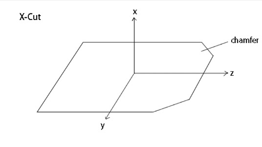

---

[PiezoelectricCoefficients2.swift](./Models/Code/PiezoelectricCoefficients2.swift)

The actual shear constant is 80 pm/V, in a direction 32° counterclockwise from Z (0 0 0 1). The electric field is always being applied across the X-axis, regardless of the rotation of the wafer cut. If Wolkow has realized this, then the 80 nm quoted from the patent corresponds to 167 V at 6 piezo plates. Not 196 V.

```
swift PiezoelectricCoefficients2.swift 0

// 0°
//  ∂(∂u/∂x1)/∂E1: SIMD3<Float>(0.0, -21.0, 34.0) pm/V
//  ∂(∂u/∂x2)/∂E1: SIMD3<Float>(-21.0, 0.0, 0.0) pm/V
//  ∂(∂u/∂x3)/∂E1: SIMD3<Float>(34.0, 0.0, 0.0) pm/V

// 0°
//  u (x-axis): [0.0, -17.9, 28.9] nm
//  u (y-axis): [-178.5, 0.0, 0.0] nm
//  u (z-axis): [289.0, 0.0, 0.0] nm

// 0°
//  u (x-axis): [0.0, -35.7, 57.8] nm
//  u (y-axis): [0.0, 0.0, 0.0] nm
//  u (z-axis): [0.0, 0.0, 0.0] nm
```

```
swift PiezoelectricCoefficients2.swift 32

// 32°
//  ∂(∂u/∂x1)/∂E1: SIMD3<Float>(0.0, 0.20824544, 39.961945) pm/V
//  ∂(∂u/∂x2)/∂E1: SIMD3<Float>(0.20824254, 0.0, 0.0) pm/V
//  ∂(∂u/∂x3)/∂E1: SIMD3<Float>(39.961945, 0.0, 0.0) pm/V

// 32°
//  u (x-axis): [0.0, 0.2, 34.0] nm
//  u (y-axis): [1.8, 0.0, 0.0] nm
//  u (z-axis): [339.7, 0.0, 0.0] nm

// 32°
//  u (x-axis): [0.0, 0.4, 67.9] nm
//  u (y-axis): [0.0, 0.0, 0.0] nm
//  u (z-axis): [0.0, 0.0, 0.0] nm
```

```
swift PiezoelectricCoefficients2.swift 41

// 41°
//  ∂(∂u/∂x1)/∂E1: SIMD3<Float>(0.0, 6.4571033, 39.437363) pm/V
//  ∂(∂u/∂x2)/∂E1: SIMD3<Float>(6.4571033, 0.0, 0.0) pm/V
//  ∂(∂u/∂x3)/∂E1: SIMD3<Float>(39.437366, 0.0, 0.0) pm/V

// 41°
//  u (x-axis): [0.0, 5.5, 33.5] nm
//  u (y-axis): [54.9, 0.0, 0.0] nm
//  u (z-axis): [335.2, 0.0, 0.0] nm

// 41°
//  u (x-axis): [0.0, 11.0, 67.0] nm
//  u (y-axis): [0.0, 0.0, 0.0] nm
//  u (z-axis): [0.0, 0.0, 0.0] nm
```

If we double the plate Y and Z dimensions to 10 mm, the 41 degree case changes from 54.9 to 109.8 nm, and from 335.2 to 670.4 nm. But after correcting for the ratio of X dimension to Y or Z dimension and summing into the X-axis shear, the true displacement is still 11.0 nm and 67.0 nm.

---

The X axis of the crystal boule doesn't create any charge when compressed. It cannot, because the crystal structure is symmetric across the YZ plane. The Y and Z axes in IRE notation are piezoelectric. That explains why they produce displacements.

I can imagine 6 symmetry operations for a valid pair of E-field axis and shear direction. The shear piezo constant is 80 pm/V, not 68 pm/V.

| X, Y, Z Principal Axes | Shear Direction |
| ---------------------- | -----------: |
| standard IRE orientation                       | Z rotated +32° counterclockwise about X |
| rotate X, Y by  +60° counterclockwise around Z | Z rotated -32° counterclockwise about X |
| rotate X, Y by +120° counterclockwise around Z | Z rotated +32° counterclockwise about X |
| rotate X, Y by +180° counterclockwise around Z | Z rotated -32° counterclockwise about X |
| rotate X, Y by +240° counterclockwise around Z | Z rotated +32° counterclockwise about X |
| rotate X, Y by +300° counterclockwise around Z | Z rotated -32° counterclockwise about X |

Due to the IRE standard, readily stocked commercial wafers only fall in the first row. But in theory, there are 5 other crystal cuts with the same piezoelectric response. Rows 3 and 5 are equivalent to row 1 by a symmetry operation. Thus, the IRE standard has prevented the opposite chirality of X-cut lithium niobate (rows 2, 4, 6) from ever reaching the market.

In Islam and Beamish (2018), the erroneous off-axis displacement would not be measured. Moving the parallel plates in a direction parallel to each other, will decrease the capacitance no matter which direction it moves. The case of zero off-axis displacement is a local maximum of capacitance. The first derivative with respect to position is zero. In contrast, the first derivative with respect to on-axis displacement (distance between the two plates) is very high. It is the only component that could affect the measurements.

## January 8, 2026

I did some investigation of why coarse tip approach is slow. There are three limiting factors:
- Allowed positional excursion before tip crashes, relative to point of minimum detectable current
- Delay for sensor to register the tip's new position
- Inertial overshoot even after the piezo stops applying force

At the speeds we're moving, capacitive currents have no effect on measurements.

| Bias Voltage | dC/dx | dx/dt | Capacitive Current |
| -----------: | ----: | ----: | -----------------: |
| 1 V          | 1.50e-10 F/m | 5.88 μm/s | 0.9 fA |
| 3 V          | 1.50e-10 F/m | 5.88 μm/s | 2.6 fA |

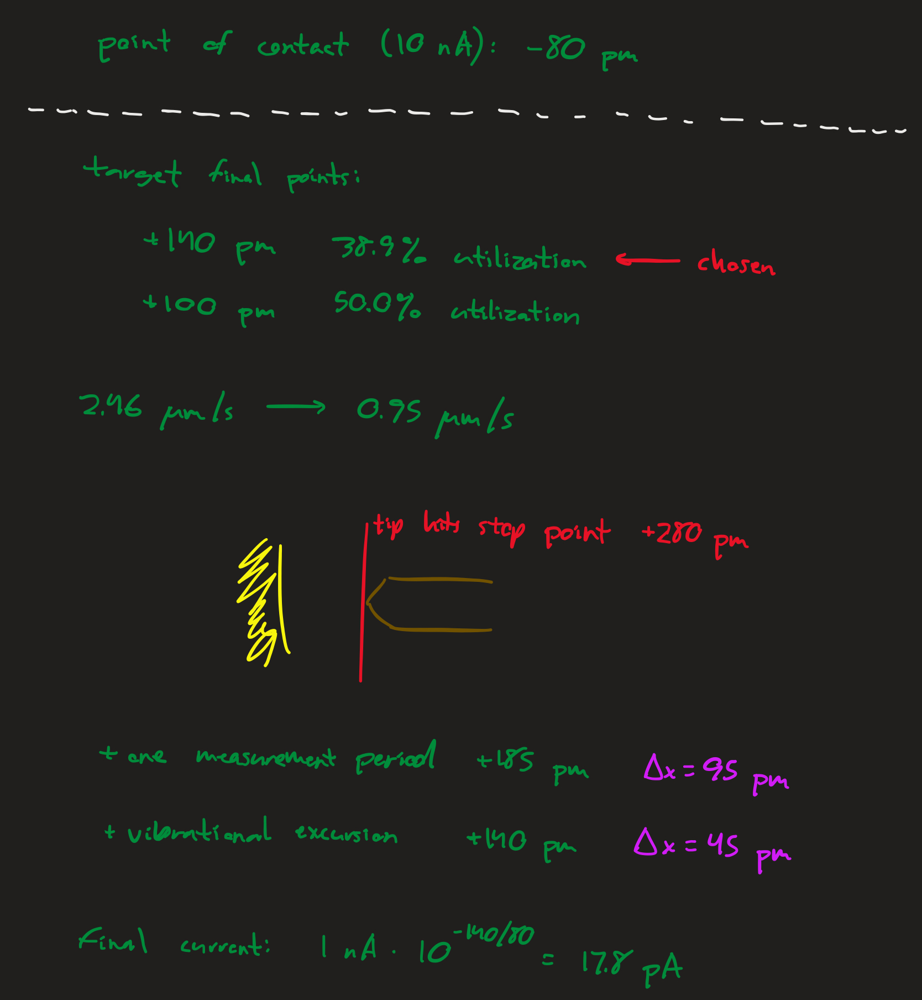

The allowed positional excursion was set to 280 pm, the difference between 1 nA and 313 fA at 80 pm/decade. True tip crash likely occurs at 10 nA, or a limit of 360 pm. To improve the safety margin, the target displacement is half of the 280 pm range, or 140 pm.

Next, the delay of the sensor. Although Dan Berard and similar STMs may have an ADC bandwidth of 200 kHz, the limiter is the ~10 kHz pole of the 100 MΩ TIA design. I also conservatively derated the ADS8699 from 15 kHz to 10 kHz. The limiter here is not digitization frequency, but rather the analog response latency from the lowpass filter.

If we model the delay as limitations on sinewave frequency, we get 10 kHz. That was used for calculations in the screenshot above. If we model it as exponential decay with a time constant of RC, we only need 2 or 3 time constants (settling to 13.5% or 5.0%), not 2π time constants. I'll correct for this in a bit.

Finally, the vibrational excursion. This is easier to model than I anticipated. The velocity is the angular frequency at resonance, times the positional amplitude of the vibration. I used [3340 Hz](https://github.com/philipturner/transimpedance-amplifier?tab=readme-ov-file#september-9-2025) eigenfrequency from FEM simulations, which is better than most STMs.

In the screenshot above, the maximum acceptable velocity was 0.95 μm/s.

### Correction for more optimistic sensor response time

| RC Time Constants | Sensor Error from Lag | Proportion of Limit from Vibrational Excursion | Maximum Acceptable Velocity |
| ----------------: | --------------------: | ---------------------------------------------: | --------------------------: |
| 6.28              | 0.2%                  | 32.1% | 0.95 μm/s |
| 3.00              | 5.0%                  | 49.8% | 1.47 μm/s |
| 2.00              | 13.5%                 | 59.8% | 1.77 μm/s |
| 1.00              | 36.7%                 | 74.9% | 2.21 μm/s |

Anything shorter than 3 RC time constants seems questionable. I'll set the revised velocity to 1.47 μm/s.

---

Next, walk through the algorithm for coarse displacements during tip approach.

Start with a conservatively slow waveform. The time to move the tip during the coarse steps is a tiny fraction of the overall time during coarse approach. Start with a 1 kHz triangle wave, 850 V peak-to-peak amplitude, or ±425 V. Displacement range is 408 nm, or ±204 nm. Each edge of the wave form takes 500 μs. Slew rate is 1.7 V/μs, much less than the PA95's limit of 30 V/μs. Speed is 816 μm/s. The kinematic mount moves back and forth at 816 μm/s in alternating directions, always returning to the same position.

| Kinematic Mount | Mass of Load | Equivalent Gravitational Force | Force in Pounds |
| --------------- | -----------: | -----------------------------: | --------------: |
| X Axis          | 13.02 g      | 127.6 mN | 0.03 lb |
| Y Axis          | 23.37 g      | 229.0 mN | 0.05 lb |
| Z Axis          | 8.94 g       | 87.6 mN  | 0.02 lb |

---

Using the N42 grade of magnets.

Magnets need to be extremely close to the surface, to achieve optimal force. I'm setting 300 μm tolerance as the practical upper limit, which nerfs magnetic force ~50% for my geometry. The smaller X and Z kinematic mount can use two 5 mm magnets, while the Y kinematic mount can use four.

Playing around with parameters on: https://www.kjmagnetics.com/magnet-strength-calculator.asp?srsltid=AfmBOorsJBupnrQ9hcxNIcvuajbopfTptJDigBCl6Y_YctyCHKSyzlxy

| Diameter | Thickness | Distance | Pull Force Case 1 |
| -------: | --------: | -------: | ----------------: |
| 5 mm     | 3 mm      | 0.0 mm   | 1.45 lb           |
| 5 mm     | 5 mm      | 0.0 mm   | 2.04 lb           |
| 5 mm     | 7 mm      | 0.0 mm   | 2.19 lb           |
| 10 mm    | 3 mm      | 0.0 mm   | 4.33 lb           |
| 10 mm    | 5 mm      | 0.0 mm   | 6.48 lb           |
| 10 mm    | 7 mm      | 0.0 mm   | 7.73 lb           |

| Diameter | Thickness | Distance | Pull Force Case 1 |
| -------: | --------: | -------: | ----------------: |
| 5 mm     | 3 mm      | 0.3 mm   | 0.73 lb           |
| 5 mm     | 5 mm      | 0.3 mm   | 1.05 lb           |
| 5 mm     | 7 mm      | 0.3 mm   | 1.15 lb           |
| 10 mm    | 3 mm      | 0.3 mm   | 2.75 lb           |
| 10 mm    | 5 mm      | 0.3 mm   | 4.19 lb           |
| 10 mm    | 7 mm      | 0.3 mm   | 5.07 lb           |

| Diameter | Thickness | Distance | Pull Force Case 1 |
| -------: | --------: | -------: | ----------------: |
| 5 mm     | 3 mm      | 1.0 mm   | 0.29 lb           |
| 5 mm     | 5 mm      | 1.0 mm   | 0.44 lb           |
| 5 mm     | 7 mm      | 1.0 mm   | 0.50 lb           |
| 10 mm    | 3 mm      | 1.0 mm   | 1.50 lb           |
| 10 mm    | 5 mm      | 1.0 mm   | 2.36 lb           |
| 10 mm    | 7 mm      | 1.0 mm   | 2.90 lb           |

We do need two magnets aligned in the center of the path of motion. Both Voigtlander and Wolkow's reference designs do this. We can just tweak the force for the Y-axis magnets to be doubled.

All numbers in the above tables are an order of magnitude greater than the amount required to counteract gravity. I will use a design where all kinematic mounts are 45° away from perfectly vertical, and the Y axis's direction of motion is perpendicular to gravity. That does not remove the disparity in load mass between kinematic mounts; it just seems like the most sensible geometry.

To start, let's set the magnet force to 0.50 lb (2.22 N) for all kinematic mounts. This is probably too large, but we can correct it later if needed. In addition, the coefficient of static friction is 0.5 and the coefficient of kinetic friction is either 0.3 or 0.4. We want to explore a combinatorial space for uncertainty in the nature of friction. Finally, the transition from stationary to the "riding" part of the waveform is smoothed out enough to not break static friction. The computer code controlling the DAC makes this part of the waveform smooth.

---

Another interesting observation is the disparity between resonance frequencies relevant to this analysis, and resonant frequency of the tip-sample mechanical loop (3340 Hz). We are localizing the analysis to the kinematic mount subsystem, which is much stiffer and spatially smaller than the whole STM. In addition, we are not examining any possible mode (the floppiest mode), but the direction of vibration parallel to motion. What we need to worry about regarding minimum eigenfrequencies, is coupling to other floppier modes and exciting them. We prevent this by only repeating the sawtooth waveform at a 1 kHz frequency. Thus, extremely high frequencies of ~50 kHz could define settling times for stick-slip action.

Shear stiffness of three 5 mm x 5 mm stacks: 600 N / 408.0 nm = 1.47 GN/m. If the stacks were 10 mm x 10 mm, the stiffness would increase fourfold and frequency would increase twofold.

| Kinematic Mount | Mass of Load | Stiffness | Frequency |
| --------------- | -----------: | --------: | --------: |
| X Axis          | 13.02 g      | 1.47 GN/m | 53500 Hz  |
| Y Axis          | 23.37 g      | 1.47 GN/m | 39900 Hz  |
| Z Axis          | 8.94 g       | 1.47 GN/m | 64500 Hz  |

Another note: since our range is a conservatively large 408 nm, we don't need to worry about extremely small displacements (80 nm) on the border of impossible to break the covalent bonds for static friction. It is now much easier to model the behavior of stick-slip action.

I'll try a sophisticated time-stepping simulation in a Swift script, with a time step of 1 microsecond. For reference, at the maximum slew rate of 30 V/μs, it takes 28 microseconds to complete the voltage ramp. By sophisticated, I mean it includes all relevant variables and calculates the kinematic equations. The integrator will be a simple Euler algorithm. Trajectory shapes will be visualized in the console, rather than a fancy graph. Although the time stepping resolution is 1 microsecond for accuracy, resolution of data presentation will be more like 5 microseconds. All numbers will be in FP32 because we don't need FP64.

At high frequency, the piezo doesn't move instantly in response to voltage. An instantaneous force of O(600 N) is generated. Then, within the resonant period of O(20 μs), the piezo moves to the expected position. There is no high-frequency creep that would lead to hysteresis. The simulation will show a growing force calculated from the difference between the piezo's actual and desired position, as set by the control voltage. The force will eventually push the piezo to the desired position, and it will overshoot (resonance), oscillating around the desired point. We should test that, in a basic form of the simulation, the oscillation never dies out because there is no damping/friction.

<b>First doable goal:</b> set up a simulation that reproduces the behavior in the above paragraph.

---

After reflecting on [this physics page](http://hyperphysics.phy-astr.gsu.edu/hbase/frict2.html), I should expand the combinatorial space for coefficient of kinetic friction. Now include 0.3, 0.4, and 0.5. There is an asymmetry between static and kinetic friction purely due to the shape of the graph.

Once the simulation is debugged and investigated, I can export CSV to plot on Google Sheets and present here. If that is needed.

I will just examine the Z kinematic mount for this analysis. Although it represents the far end of the distribution of load masses, it is a sane way to reduce the size of the combinatorial space. Compared to examining two or three kinematic mounts. I will also change so, instead of pointing at a 45-degree angle, gravity points directly parallel to the direction of motion. This choice simplifies the code.

## January 9, 2026

I just sorted out a few more interesting details about how to simulate kinetic friction. I will incorporate the notes into the Swift script.

[StickSlipAction.swift](./Models/Code/StickSlipAction.swift)

I have reproduced the piezoelectric vibration quite intricately. The first doable goal is completed. I added viscoelastic damping and smoothed out the control voltage waveforms, slightly reducing the amount of vibrational energy.

Task 2: add kinetic friction

<s>Task 3: add gravity and vary the magnet's strength</s>

[StickSlipAction2.swift](./Models/Code/StickSlipAction2.swift)

The script has improved significantly. I plan on investigating gravity &times; magnet force, after studying coefficient of kinetic friction &times; kinetic velocity threshold &times; slew rate.

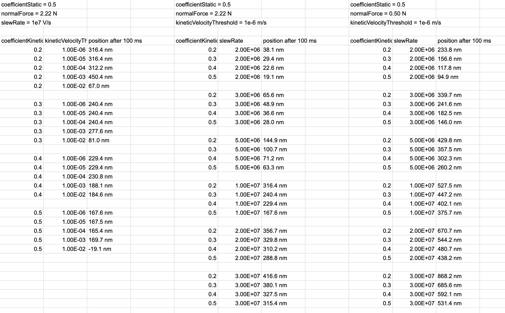

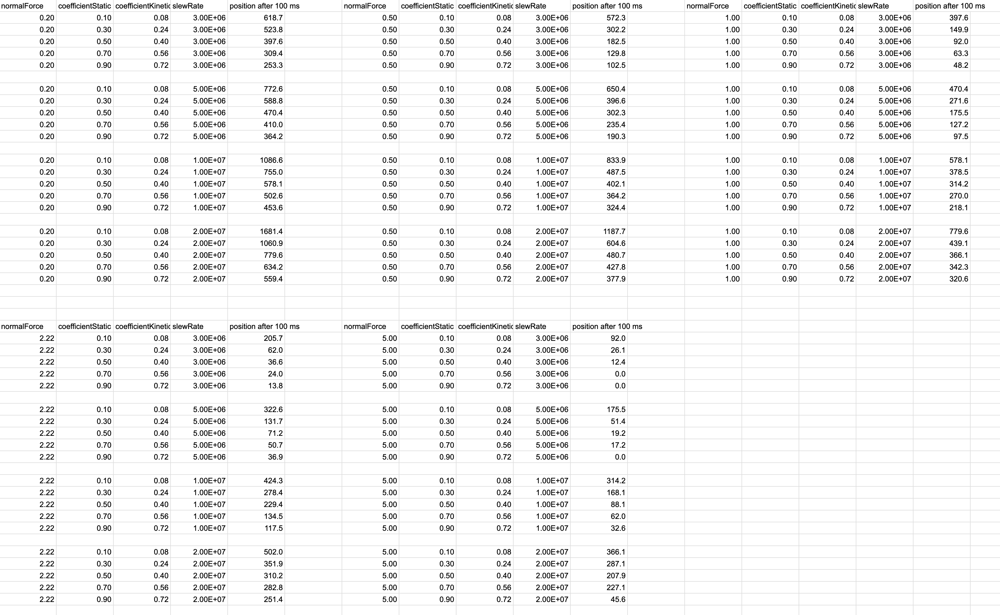

I still plan to study the effect of gravity, and using stronger magnets to prevent bad outcomes. I have the time budget to do due diligence here.

## January 12, 2026

I found an error in the script. Instead of the piezo stiffness being 1.47 GN/m, it should be 1.73 GN/m. The problem stems from taking 600 N / 408 nm, when the two inputs to this division are incorrect. The piezo constant has changed from 68 pm/V to 80 pm/V. Either take 705 N / 408 nm or 600 N / 347 nm.

Regarding stiffness: shear modulus is set to 69.2 GPa. Copper plates and epoxy could make the piezo more compliant. Copper has 2/3 the Young's modulus of LiNbO3 and consumes ~50% of the stack's volume. Epoxy is 3 GPa and consumes 10% or less of the volume. Before derating the stiffness by 50%, I need to work through the piezoelectric constitutive equations and understand the effects.

I think we can neglect the effects of epoxy on stiffness. A non-negligible layer would derate the stiffness by a factor of up to 10. In the literature, a resonance frequency of 171 kHz matched bulk moduli of LiNbO3 and Cu after dividing the frequency by 2. Alternatively, the questionable "electromechanical transformer ratio" of 0.15 N/V reflected stiffness derating of epoxy consuming 5% of total volume.

| Model | Stiffness, 1 Plate | Stiffness, 6 Plates | Stiffness, 3 Stacks |
| ----- | -----------------: | ------------------: | ------------------: |
| single LiNbO3 plate (0.5 mm)  | 3.462 | 0.577 | 1.731 |
| plate + Cu electrode (0.5 mm) | 1.288 | 0.215 | 0.644 |
| above + epoxy layer (0.05 mm) | 0.388 | 0.065 | 0.194 |

_All table entries are in GN/m._

| Model | Stiffness, 6 Plates | Resonance @ 1.02 g |
| ----- | ------------------: | -----------------: |
| single LiNbO3 plate (0.5 mm)  | 0.577 GN/m | 119.7 kHz |
| plate + Cu electrode (0.5 mm) | 0.215 GN/m |  73.1 kHz |
| above + epoxy layer (0.05 mm) | 0.065 GN/m |  40.2 kHz |

I need to revise the kinematic mount's stiffness to 0.644 GN/m. Compared to yesterday's data, vibrational responses should be 1.5x slower.

For the piezoelectric constitutive equations, shear modulus (c<sup>E</sup>) should change from 69.2 GPa to 25.7 GPa.

---

I have now documented the entire combinatorial space of variables for a kinematic mount:
- Different axes (X, Y, Z) having different masses
- Coefficient of static and kinetic friction, not necessarily being proportional to each other
- Various slew rates up to the limit of 30 V/μs
- Gravity acting toward, against, or perpendicular to stepping direction
- Magnet strength varying from 0.1 N (0.02 lb) to 5.6 N (1.26 lb), on a logarithmic scale with 1.4x steps

[LiNbO3 Piezo Calculations (Google Sheets)](https://docs.google.com/spreadsheets/d/1vBnCa-WxlORrH1MnVM8QzBGzUekIoL9DoZVunZ4Nscg/edit?gid=2067282552#gid=2067282552)

The Google Sheet covers 1.65 thousand permutations of the ~5 controlling variables. Next, I will study the data and make sense of it. If possible, draw conclusions that help with IRL design specification.

### Insights

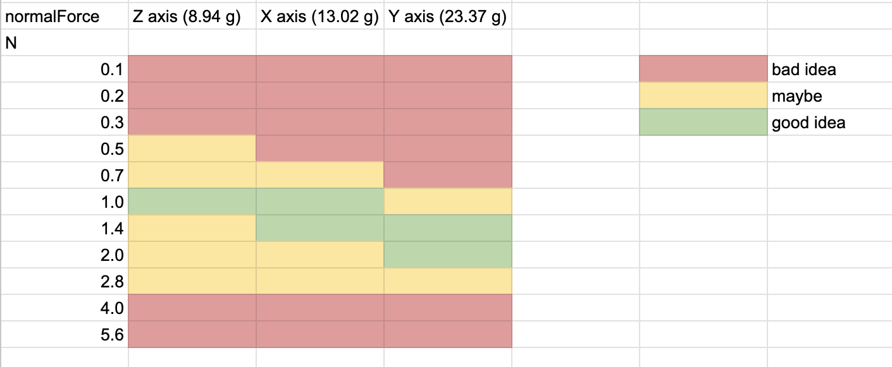

I will likely need to test a few permutations of the design IRL, to calibrate the right magnet force. Also, be cautious about magnets demagnetizing in UHV during bakeout.

I can also run FEM simulations with Elmer in FreeCAD. Use [FEM EquationMagnetodynamic](https://wiki.freecad.org/FEM_EquationMagnetodynamic) and calculate nodal forces. Also, valuable statement from the FreeCAD docs:

> Despite the name, the Magnetodynamic equation can be used to perform magnetostatic analyses.

## January 13, 2026

I now need to embark on a difficult task: specify the core mechanical layout of the metrology junction. But before that, I would like to read up more on epoxy. Specify how LiNbO3 piezo stacks would be fabricated.

A couple of questions (but not all):
- What temperature is epoxy baked at?
- Are rough or smooth substrate surfaces best for applying epoxy?
- How much does UHV-quality epoxy cost?

---

24 V * 80 pm/V * 6 = 11.52 nm

I could speed up progress by ordering the AH2550 now, and testing the first LiNbO3 piezo stack with low voltage. The metrology junction should be capable of both shear and longitudinal piezo types. Alternatively, ThorLabs sells [single shear piezos](https://www.thorlabs.com/low-voltage-shear-piezoelectric-chips-and-stacks) for \~$90. This cost pales in comparison to the AH2550 (\~$1,000).

This product has the same physical dimensions as a 5 mm x 5 mm x 0.5 mm LiNbO3 piezo plate. It has a piezo constant of 2.00&ndash;3.25 nm/V, depending on hysteresis and creep. Compare that to a stack of six LiNbO3 plates, at 0.48 nm/V.

Two derisking notes:
- Consider buying an extra pack of ten 5 mm x 5 mm plates from Crystal Substrates. If the experiment with 6 plates fails, I will barely have any backup. And the 3 week lead time is concerning. Alternatively, use 4 plates (just 7.68 nm displacement) for this experiment.
- To do due diligence in saving time, ask whether ThorLabs could contract out the labor and equipment for bonding plates with epoxy. If their lead times are as ridiculous as Boston Piezo Optics (6&ndash;8 weeks), fabricate the piezo stacks in-house.

Jumping directly to using AH2550, instead of designing a PCB with AD7745, will save much time. Another time saver is trying the DAC81401 with hand-soldering, just higher tip temperatures this time. Design the circuit to easily swap in up to 10 trial boards for the DAC. No need for the complexity of solder paste and reflow ovens yet.

Perhaps, with the type of displacements involved, we don't even need the DAC. Just a battery with a multimeter checking the exact voltage. But we are building hardware infrastructure for the kinematic mount in Phase I and II. That will require programmable, controlled waveforms amplifying the DAC8140x output to the PA95. It's better to not cut corners, and to also fix the problems causing DAC failure in Phase 0.1.

| Function | Cheap Option | Expensive Option |
| -------- | ------------ | ---------------- |
| power supply | 9V batteries, ±18&ndash;22 V regulators | Matsusada ±650 V power solution |
| DAC      | DAC81401, ±12&ndash;20 V | PA95, amplify ±20 V to ±425 V |
| ADC      | ADS8699        | oscilloscope |
| capacitance sensor | AD7745 | AH2550 |

_By switching to the expensive options, the number of TSSOPs on a custom PCB is reduced. That reduces the need for reflow soldering, and reduces design cost of PCB layout._

24 V regulators may be a more expensive product grade than 18 V regulators. The DAC81401 cannot operate with 48 V across its power terminals; only 44 V absolute maximum, 43 V recommended. In the Art of Electronics, one possibility is adjustable regulators like LM317, except rated for higher voltage.

Another option is, in the final design, amplify ±12 V to ±425 V. That would be a gain factor of 35.4 instead of 21.3. The example circuit on the PA95 datasheet has 100x gain and a 10 pF compensation capacitor. With a 4.7 pF capacitor, the gain-bandwidth tradeoff sets a maximum bandwidth of 100 kHz at 100x gain. But this curve is just for small signals and calculating loop stability. At large signals, a 4.7 pF capacitor limits the frequency to 15 kHz for 850 Vpp swings.

I think there is enough product selection, as least for adjustable LM317-style regulators, to have 36 V input and 21.5 V output of both polarities. At least for this experiment in the low-voltage regime, I would prefer ±20 V instead of ±12 V. Maximum piezo stacks should be 4 plates, at least for now because of limited stock. In the future, a full kinematic mount and multiple fine axes will require more orders from Crystal Substrates. At that point, I will consider 6 plates to maximize range.

| Actuator | Piezo Constant | Range |
| -------- | -------------: | ----: |
| ThorLabs shear plate | 2.00 nm/V | 80.0 nm |
| single LiNbO3 plate | 0.08 nm/V | 3.2 nm |
| four LiNbO3 plates | 0.32 nm/V | 12.8 nm |

_Displacements of various actuators accessible with 40 Vpp and existing stock of LiNbO3 plates. In the Islam and Beamish papers, sensor resolution was 0.1 nm with 4 seconds of averaging time._

---

I just got some leads on lower-cost alternatives to $2500 and $3000 costs for pristine (not "textured") Au(111) samples. I will need to question the suppliers and ensure they actually did the annealing step after sputtering.
- [Arrandee - $139.79](https://www.arrandee.com)
- [MSE Supplies - $299.95](https://www.msesupplies.com/products/platypus-high-quality-gold-au-thin-films-on-substrates)
- [Ted Pella - $147.40](https://www.tedpella.com/vacuum_html/Substrates_Supports_Wafers_Slides.aspx#_16012_G)

I'm still trying to stay on good terms with Wolkow. It's just, all the economic motivations require that I act in my own interests. I wish him the best of luck in proliferating creepless SPMs, but his products have insufficient specifications for my research. That's why I need an open source design.

## January 14, 2026

Today's discoveries:
- Use a Controleo3 reflow oven to cure the epoxy at 120°C
- Best if a compact 3D-printed or similar isolator is used, rather than a bulky table like the OpenSTM design. Keep the same height dimension, just shrink the lateral dimensions.
- By averaging several samples each at 9.1 Hz, it might be possible to vastly surpass the ~25 aF six-sigma noise of the AD7745

## January 15, 2026

Instead of 9V batteries, I should try sourcing the ±21.5 V and ±15 V linear regulators from a commercial "power box". The box(es) rely on residential AC power and output a bipolar ±30 V. Through a chain of low-voltage regulators, this box also supplies +5 V and +3.3 V for digital circuitry in the data converters. Altogether, the power module should not cost more than $100. I would like it to be cheap.

To run the DAC81404 at ±20 V output, tolerance from the linear regulator is razor thin. Recommended maximum and amount of power supply footroom is 1.5 V. Absolute maximum is 2.0 V. I will need to run the math on tolerances for LM337-style regulators. Even 2% off from 21.5 is 21.0 or 22.0. The reference voltage of the LM337 can vary ±4%. We will need trimming potentiometers.

It looks much simpler to take the range reduction of ±20 V -> ±12 V. The plan is to recycle this one PCB for Phase 0.2, I, and II. In later phases, we only need ±12 V for bias voltage, and the increased gain of 20x -> 35x for PA95 is acceptable. Design cost and usability issues are lower, if a single ±15 V regulator supplies both the DAC and TIA. Even if a separate regulator supplies the DAC vs. TIA, the advantage is clear.

---

Phase 0.2 hinges on using averaging over multiple data samples, to drastically improve the resolution of the AD7745. Here are the multiplicative factors:
- Taking ~100 samples at ~10 Hz, reduce 6σ noise from 25.5 aF to 2.67 aF. Compare that to 1.3 aF from the Islam and Beamish paper, and the 0.8 aF limit for AH2550A. <b>10.0x</b>
- One vs. four LiNbO3 plates: <b>4.0x</b>
- 24 V vs. 40 V range: <b>1.67x</b>
- Orienting plates along the 32° shear direction: <b>1.17x</b>

Let's examine this, starting with a single LiNbO3 plate, not aligned at any angle, and no improvements stated above. 68 pm/V * 24 V = <b>1.63 nm</b>. 25.5 aF * (1 nm / 13 aF) = <b>1.96 nm</b>.

Now, just examine the improvement from averaging 100 samples for 10.0 seconds. 2.67 aF * (1 nm / 13 aF) = <b>0.21 nm</b>. The displacement is now vastly within resolution of the sensor.

Instead, consider only improving the state of a single LiNbO3 plate. 80 pm/V * 40 V = <b>3.20 nm</b>.

Finally, consider only changing the number of plates. 4 * 68 pm/V * 24 V = <b>6.53 nm</b>.

|               | Piezo Range | Sensor Noise Envelope |
| ------------- | ----------: | --------------------: |
| Original      | 1.63 nm     | 1.96 nm               |
| Improvement 1 | 1.63 nm     | 0.21 nm               |
| Improvement 2 | 3.20 nm     | 1.96 nm               |
| Improvement 3 | 6.53 nm     | 1.96 nm               |

Both Improvement 1 and Improvement 3 make me highly confident the metrology can work. Improvement 2 could make-or-break the results, but is very close to the margin of error for theoretical calculations.

We can choose to use the lower voltages of ±12 V, supplied by fixed ±15 V regulators.

---

Regarding DAC power consumption, the PA95 datasheet shows 100 kΩ as the larger resistance of an inverting amplifier example. The datasheet also mentions 1 MΩ being an acceptable feedback resistor. With 0.2&ndash;0.5 pF parasitic capacitance, the R<sub>f</sub>C<sub>f</sub> pole would be 318&ndash;796 kHz.

| Small Resistor | Large Resistor | Current | Current x3 |
| -------------: | -------------: | ------: | ---------: |
| 2.8 kΩ         | 100 kΩ         | ±4.25 mA | ±12.75 mA |
| 28 kΩ          | 1 MΩ           | ±0.43 mA |  ±1.28 mA |

These currents are less than the ±15 mA drive capability of the DAC81404. We do not know whether this spec applies to each DAC channel individually, or the sum of all currents exiting the chip at any moment. Allowing ±45 mA out of the chip would actually not approach any limitation for the regulator. Phase 0.1 used LM78/LM79 instead of LM78L/LM79L. These support up to 1.5 A of current.

---

Other design simplifications today:
- Use just the 100 MΩ TIA instead of the 330 MΩ TIA. We are not working with extremely low currents like the Si + Si junction, which doesn't even show a detectable current at standard biases of 1 V. We are performing STM on conductors, not insulators. Typical currents are in the nanoamps.
- Use v<sub>bias</sub> only and not v<sub>comp</sub>. Even through Phase III, it's advantageous to avoid liquid nitrogen if possible. Bubbles in the evaporating liquid may cause vibrations, which require an internal isolator inside the UHV chamber. Cryo also may prevent optically guided tip approach. No need to test possibilities for capacitance sensing to improve usability of coarse tip approach, in the absence of optical guidance.
- The kinematic mount should also serve as the fine Z axis. If there are backlash problems (the simulations suggest so), just halve the range of the step from 408 nm to 204 nm. We can finally afford this because the range is now so large. And there's a very high chance someone got it working with 80 nm range.

There will be just one DAC chip, the DAC81401. Three of its ±12 V outputs will go to the three PA95 instances for later phases of the roadmap. The fourth output is the piezo control voltage in Phase 0.2, and the bias voltage in Phase II. Phase I just uses the first of the lines designated for PA95.

| Signal | Chip | Teensy Port |
| ------ | ---- | ----------- |
| fine X, 10 mm plates  | DAC81404 port 1 + PA95 | SPI0 |
| fine Y, 10 mm plates  | DAC81404 port 2 + PA95 | SPI0 |
| coarse Z, 5 mm plates | DAC81404 port 3 + PA95 | SPI0 |
| Phase 0.2 / v<sub>bias</sub> | DAC81404 port 4 | SPI0 |
| current | OPA828 + ADS8699 | SPI1 |
| capacitance | AD7745 | I2C |

We will assemble the board with reflow soldering, in the Controleo3 oven that also bakes epoxy. We will not engineer detachable PCBs just for failed DACs. <b>That drastically worsens design cost.</b> Instead, we will:
- Follow standard procedures for bypass capacitors and ESD mitigation. Use 0.1 μF + 10 μF, not 1 μF for the DAC. ADC will still use 1 μF + 10 μF.
- Use higher yield techniques: reflow soldering primarily, then higher tip temperature for hand soldering
- Order 5 spare chips for TSSOPs/QFNs and 5&ndash;6 copies of the PCB. We have the funds, and ~$252 extra here pales in comparison to ~$2500 for the commercial E-boxes.

## January 16, 2026

Two of these for Phase 0.2: https://www.amazon.com/Tekpower-TP3005T-Variable-Linear-Alligator/dp/B00ZBCLJSY

## January 20, 2026

I should use FreeCAD to create a professional, computer-generated technical drawing of my desired chamfer for LiNbO3 plates.

I can use these openly available dimensions to model the 650 V power supplies in FreeCAD: https://www.manualslib.com/manual/2615215/Matsusada-R4g-Series.html?page=18#manual

## January 24, 2026

[Vibration Isolation (Google Sheets)](https://docs.google.com/spreadsheets/d/1qzJEl3N8RIIDTsI8JntsrjS57pulaAYeZJ12WaDHFCc/edit?usp=sharing)

[Custom Isolator Investigation (Google Sheets)](https://docs.google.com/spreadsheets/d/1jo_KR99LT2sn_qSUho-MS6aLhETTfZkYWSGUg9xkJJw/edit?usp=sharing)

Eddy current damping is actually needed. Viton damping is superfluous and increases the mass of the STM table beyond acceptable limits (5 kg target mass). 

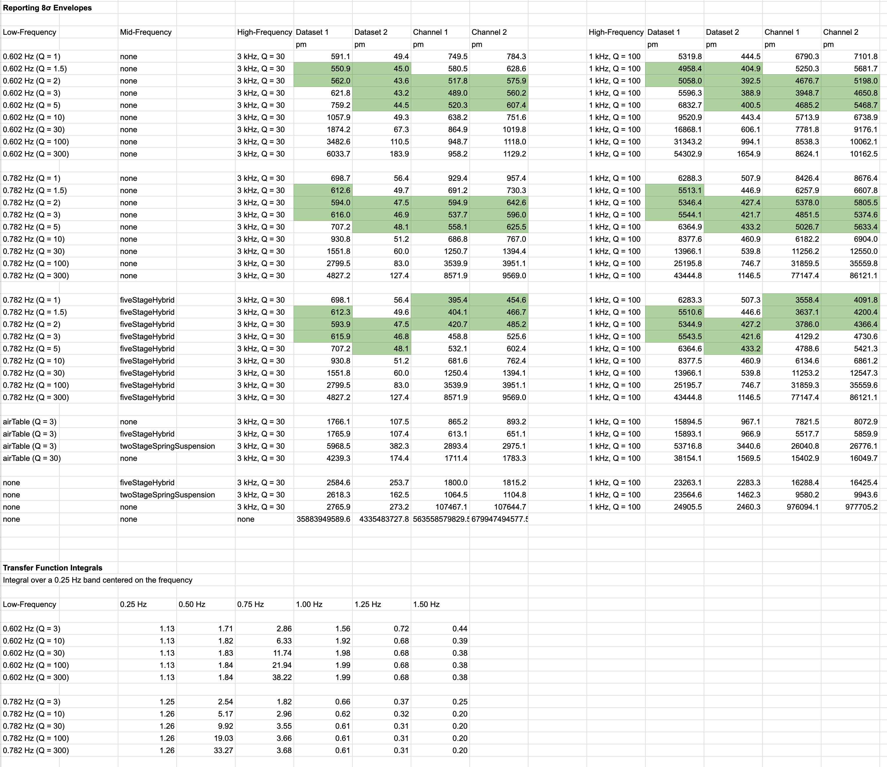

According to the above data, the optimal Q-factor is 2&ndash;5. 10 might not be bad, but 30 will definitely cause problems. Without eddy current damping, there's a very high chance the Q-factor is above acceptable limits.

I found a simple formula to calculate the Q-factor from the half-life of vibration amplitude. Note that amplitude and energy decay at different rates.

$Q = \frac{\pi}{\ln(2)} t_{1/2}$

$t_{1/2} = \frac{\ln(2)}{\pi} Q$

| Q-factor | Amplitude Half-Life |
| -------: | ------------------: |
| 1 | 0.22 |
| 1.5 | 0.33 |
| 2 | 0.44 |
| 3 | 0.66 |
| 5 | 1.10 |
| 10 | 2.21 |
| 30 | 6.62 |
| 100 | 22.06 |
| 300 | 66.19 |

_Data are in units of oscillation cycle count._

<b>Vertical and horizontal Q-factors are different</b> because the mechanism of magnetic field change is different for these two directions. People probably tune the Q-factor for the horizontal direction, with no rigorous treatment of the vertical Q-factor.

## January 26, 2026

I just ordered a massive bill of materials: $1,288.00

[Bill of Materials (Google Sheets)](https://docs.google.com/spreadsheets/d/1jiTSs0toMQvT6W_lkJ8dDeunRTFTPh3OK27fztuSNeY/edit?usp=sharing)

I recently finished a deal with Crystal Substrates. I paid approximately $1,500 and the desired quantity of spare LiNbO3 wafers will arrive in mid-March. I am also working on a deal with Matsusada, which will cost about $2,000 after tariffs. It will arrive in late February or early March.

Controleo3 reflow oven kits cost $395.00 and cannot be bought until January 31. I ordered the toaster oven itself in the above BOM.

Industry practice is to keep things secret. Quotes provided by hardware vendors are confidential information. I had to get approval from Matsusada to use the L x W x H dimensions in the open-source FreeCAD project (LabSpace.FCStd). However, it is important to disclose the true costs, especially given how revolutionary creepless SPM is, to save time for others trying to reproduce it. I concealed exact component costs not stated in the public catalog.

I based this vibration isolator on information from Weilin Ma and Dan Berard's public images. The benefit of open-source science is saving time for people trying to reproduce it in the future. Closed-source competitors like Nanofactory CBN Inc. and Quantum Silicon Inc. are wasting my time, gatekeeping information.

## January 29, 2026

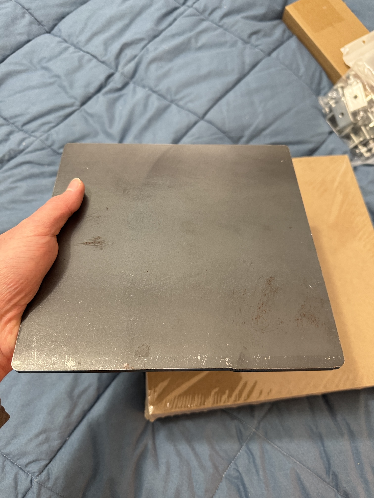

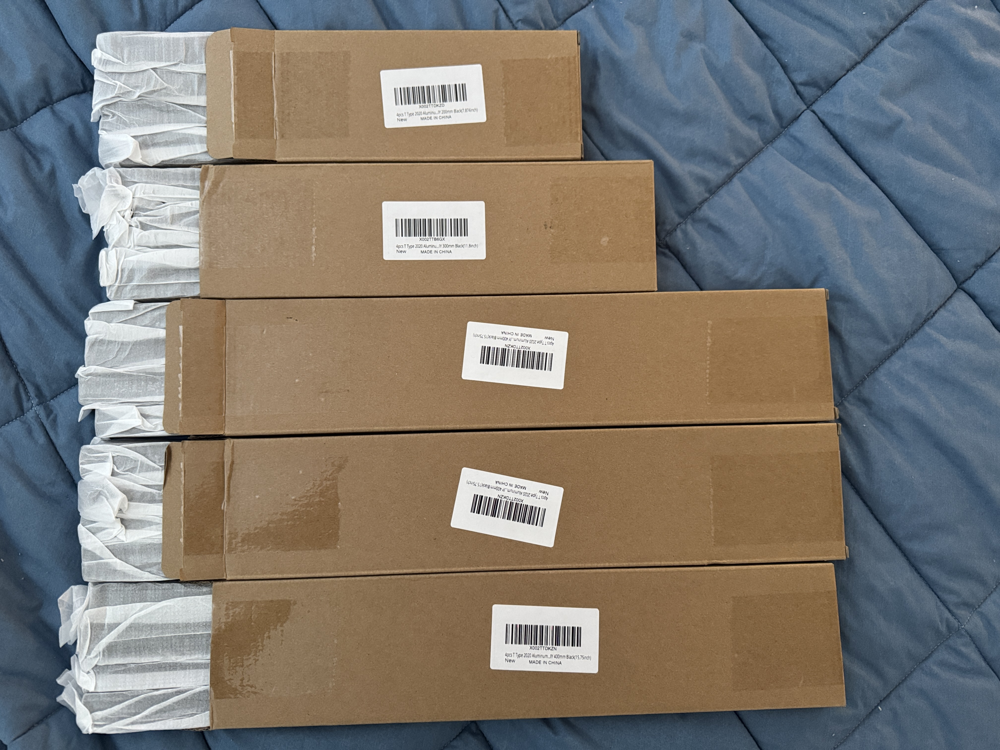

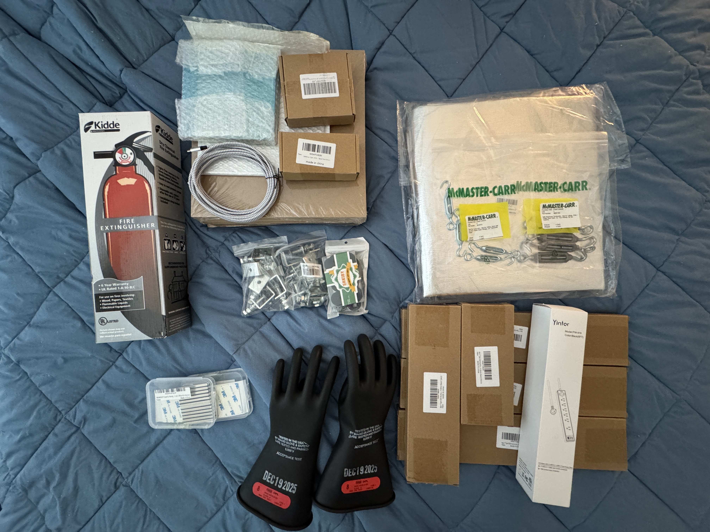

## January 30, 2026

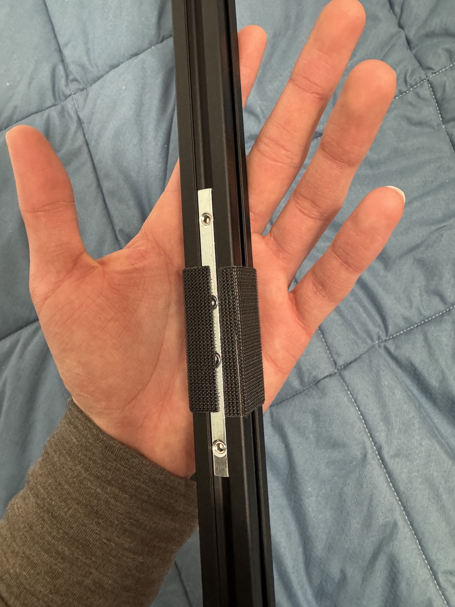

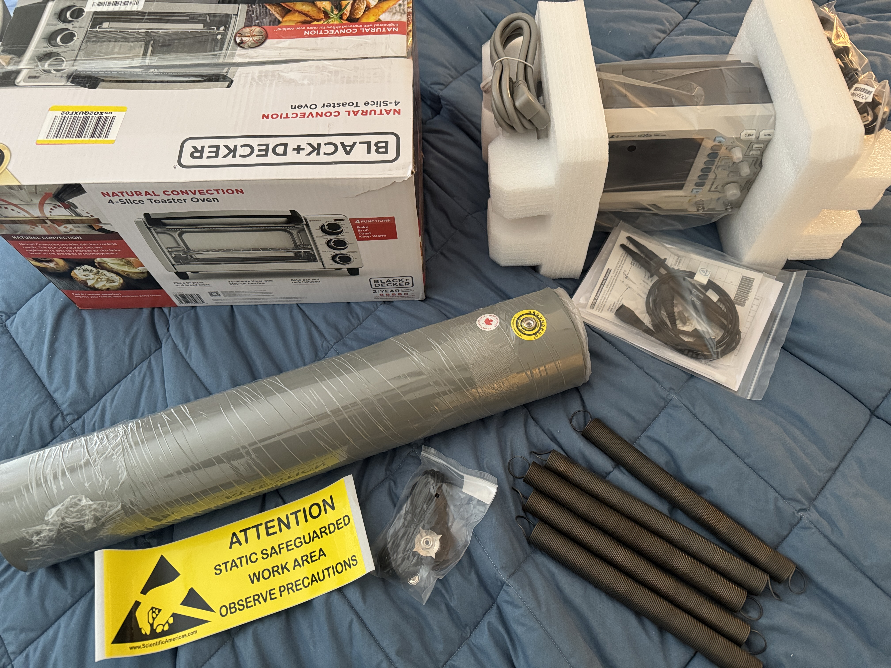

I don’t know how, but both the vertical and horizontal resonances almost match the performance of Minus K isolators: 0.5 Hz. Dan Berard and others were 2.0 Hz. Best vibration isolator in the history of DIY STM (after Q-factor is reduced). 0.9 meters tall.

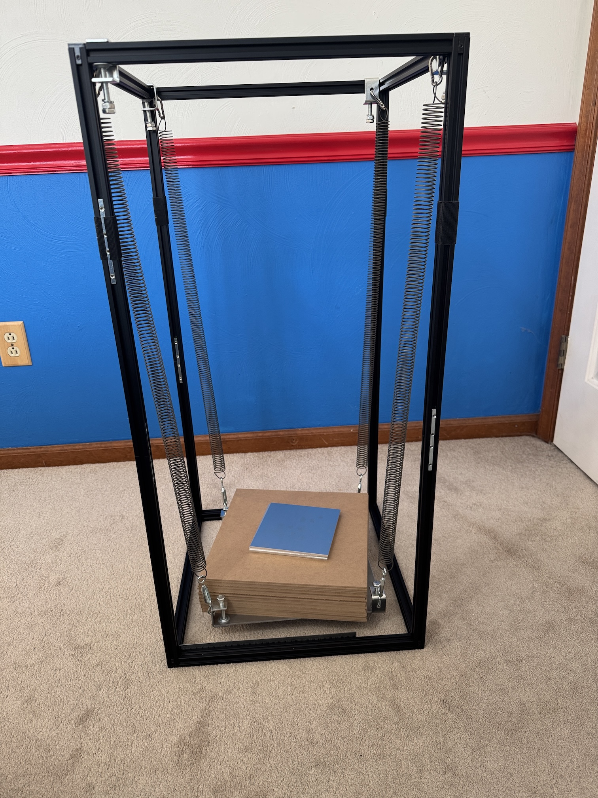

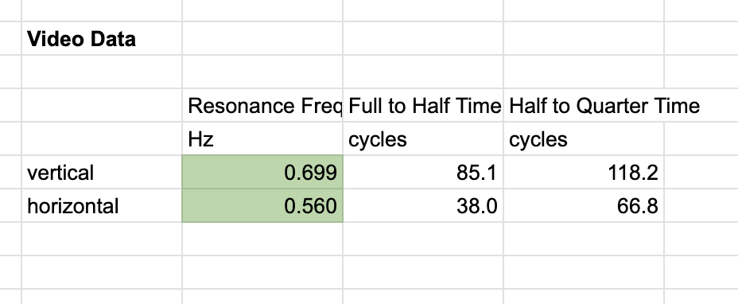

<p align="center">
&nbsp;
  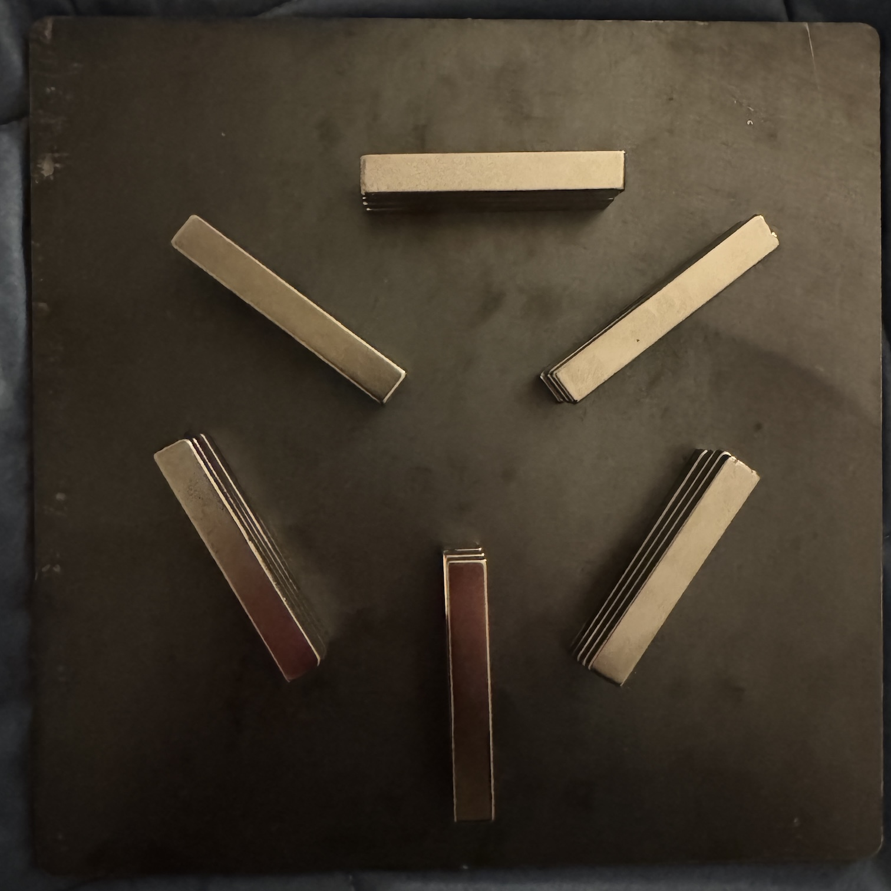
&nbsp;&nbsp;
  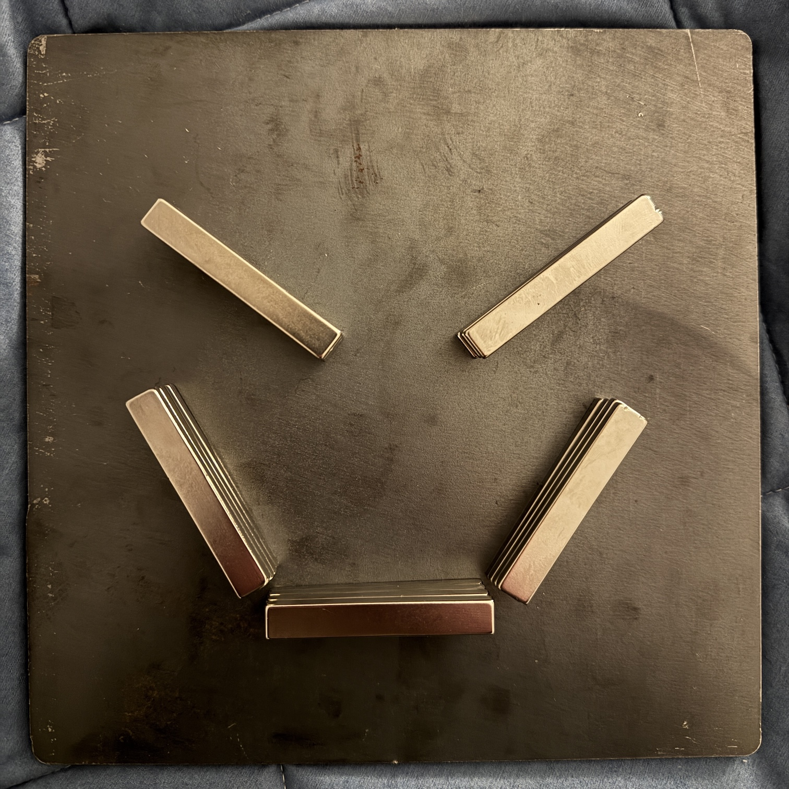
&nbsp;
</p>

## February 2, 2026

The Q-factor has been tuned. Close to 14 for both axes. Behavior of the Q-factor was slightly different than anticipated. The block of aluminum in the center indeed disproportionally damps Z more than XY. However, without the block, XY was about 38 and Z was about 25. So it doesn't make sense to widen a disparity in this direction (25 and 13).

I ended up with no special block of aluminum in the center, and just 0.65 cm distance from the magnets, instead of 1.3 cm. Analyzing each video took probably 10 minutes, and I didn't have the motivation to analyze 3 trials per configuration.

[Custom Isolator Investigation - Video Data (Google Sheets)](https://docs.google.com/spreadsheets/d/1jo_KR99LT2sn_qSUho-MS6aLhETTfZkYWSGUg9xkJJw/edit?gid=1881620548#gid=1881620548)

DIY VIBRATION ISOLATION SUB-PROJECT COMPLETE

### Recap

Current state of progress:
- All equipment on the BOM has arrived. Ordered the new Whizoo Controleo3 kit that just released.
- 99% finished with the Matsusada deal. Registered my corporation with Customs and Border Protection to import the two power boxes from Japan.
- Working through some revisions to the Crystal Substrates order. The technician says my first FreeCAD drawing is unrealistic, so we are figuring out alternatives.
- Having productive private discussions with CCDC/CSD-Core regarding organotins. Also good progress on the contract work with ChimiaDAO regarding both Ge and Sn tripods.
- About to have a private discussion with Scienta Omicron about the weird vacuum "doors" (load-lock chamber component) and a few other questions.
- All chips for the Phase 0.2/I/II PCB system have been decided. We also know the exact power supply voltages and a few protection diodes across the 450 V lines.

## February 3, 2026

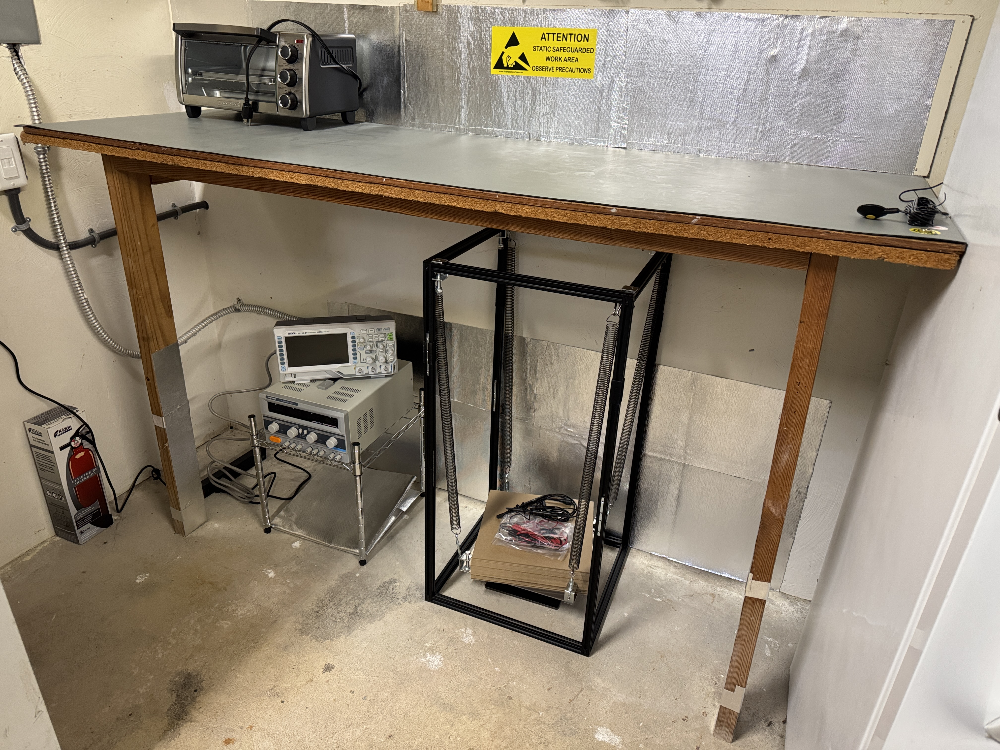

## February 11, 2026

I have answered many design questions about the PCBs. I was researching shielded RF connectors. The best approach is to start with mechanical design of Phase 0.2, I, II junctions. Work back from there.

Doing this step next will pave the way to answer the following questions:
- Which wires need to be coaxial?
- Are bulky SHV connectors actually needed for the piezo voltages?
- How do we prevent 430 V control voltages from coupling to sensitive parts like the ADC and preamp?
- What does the electromagnetic shielding look like?
- What is the length of connecting cables?

I need to figure out the exact connectors to use, but not the length of the cables. From that information, I can specify rough PCB dimensions and physical structure. Work back from that to figure out where electrical contacts are made on the STM junction. Finally, I can figure out the length of connecting cables.

The physical dimensions/layout of the STM and PCBs need to be resolved together. You cannot have one without the other. It's a paradox: neither is specified in enough detail yet. It's probably best to return to this problem tomorrow, when my mind is fresh.

---

I am deciding to reduce the scope of the PCB design work for Phase 0.2. I will build off the library of datasheets and symbols/footprints. I will use the same isolators, converters, regulators, and low-voltage power supply as Phase I/II. I am just archiving the 6 KiCad projects into a "PhaseI" folder, and continuing with a reduced subset.

Just looking at the Phase 0.2 capacitance junction, a 5 mm x 5 mm LiNbO3 piezo doesn't seem large enough to hold the weight of the associated plate. It looks mechanically unbalanced or wobbly. Moreso if a stack of 3 plates is used. I'll have to think very deeply about this.

---

I unpacked one of my 5 mm x 5 mm LiNbO3 plates for the first time, and tested a 14 mm x 16 mm x 16 mm pyrite cube on top of it. The cube balances and is mechanically stable. Just keep the center of mass over the piezo plate.

I will reproduce the Islam & Beamish junction as closely as possible, except the larger block has smaller dimensions (14 x 14 x 16 -> 10 x 10 x 12 mm). Both the ThorLabs plate and the existing LiNbO3 plates are 5 mm x 5 mm. I am not bothering with the complex setup from the Harvard (2024) paper, although I will take inspiration from how they arranged their electrodes and BNC connectors.

The Islam & Beamish paper used both machining and epoxy handling. I will have to get basic experience with both. This is a great, simple testing ground for learning these skills. Less demanding than a full STM body or multi-plate piezo stack.

I can also use copper foil to easily assemble a piezo stack held together by magnetism. This would triple the range of the LiNbO3 shear piezo. It is slightly different than stiffer "copper shim" used for piezo stacks. Actually, for non-UHV conditions, aluminum foil could be even more practical.

## February 12, 2026

A good, stiff STM should have a resonance frequency in the several kHz. When a mechanical device wobbles with a frequency in the single Hz range, something is wrong.

I tried assembling a stack of 3 plates, with electrodes made of two scraps of aluminum foil. It was very tedious to assemble: the stack kept falling apart, and I only got to balance the pyrite block on the 2nd attempt. When placing the block on the stack, it wobbled with a frequency in the single Hz range. When removing the foil and just stacking the flat plates themselves, the wobble disappeared. The same dichotomy happened with a LiNbO3 plate inside its plastic packaging, versus outside.

I split the two 5 mm x 12 mm scraps of aluminum foil into four 5 mm x 6 mm scraps. Then, I assembled the piezo stack like before, except odd and even electrode pairs weren't connected. This stack almost fell apart from the vibrations of something hitting the table. The pyrite block still wobbled when placed on top.

I tried omitting all electrodes except the piece of foil between the 1st and 2nd plate. The pyrite block still wobbled. Finally, I tried once more with only the piezo plates and no foil. The wobble did not exist. From this investigation, I can conclude that the simple "aluminum foil" piezo stack is impossible for Phase 0.2.

| Configuration | Piezo Stack | Balancing Pyrite Block |
| ------------- | ----------- | ---------------------- |
| only piezo plates    | 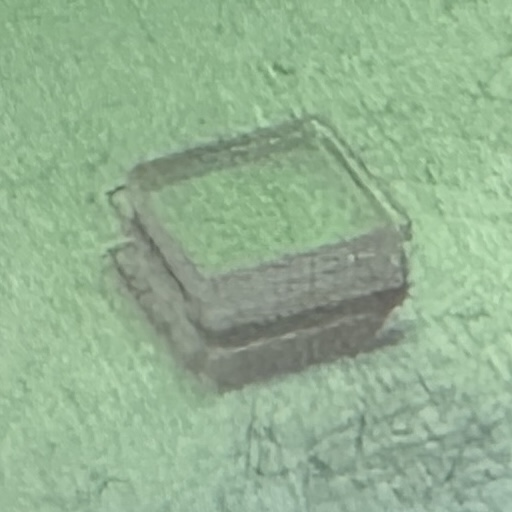 | 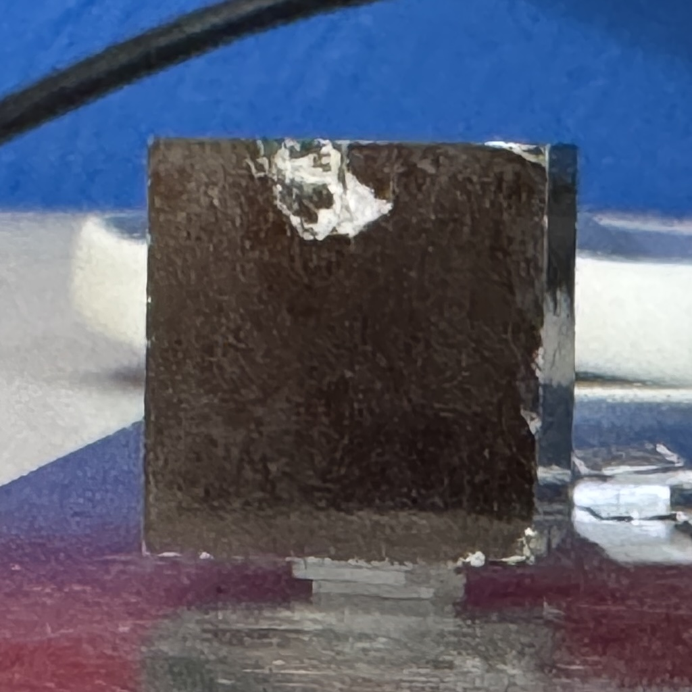 |
| two foil electrodes  | 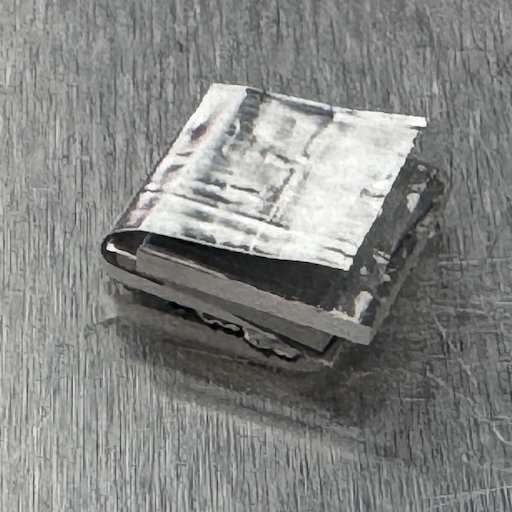 | 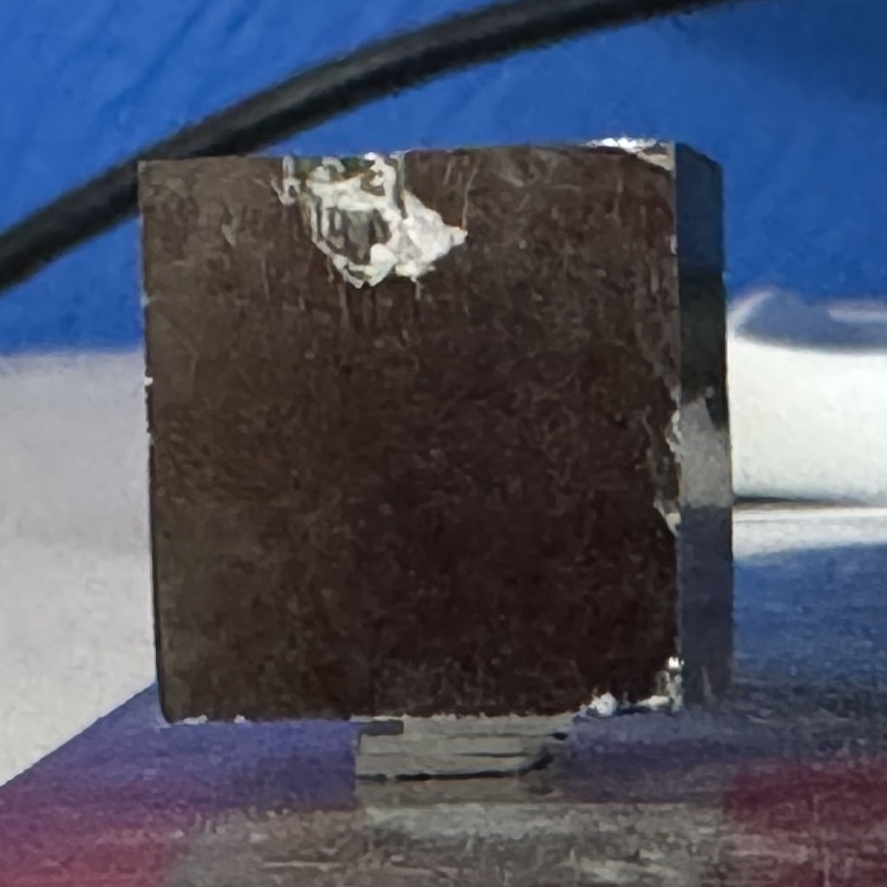 |
| four foil electrodes | 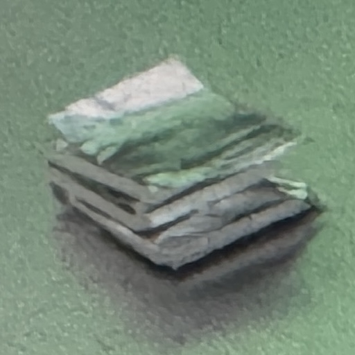 | 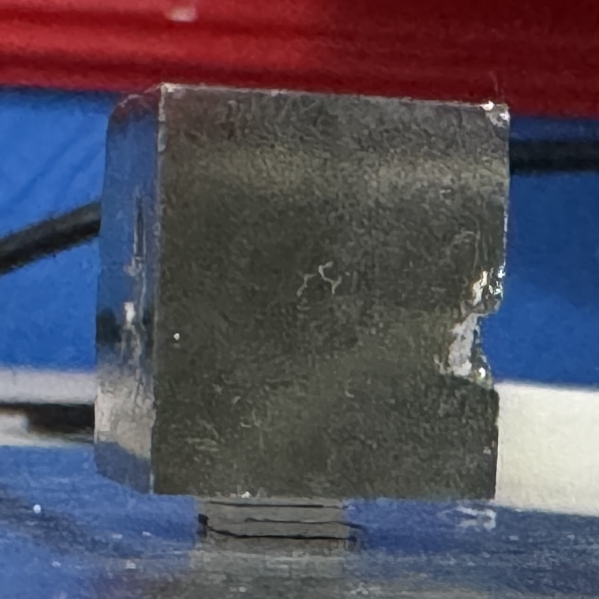 |
| one foil electrode   | 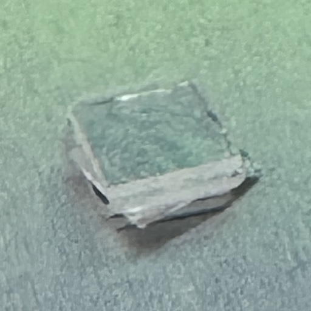 | 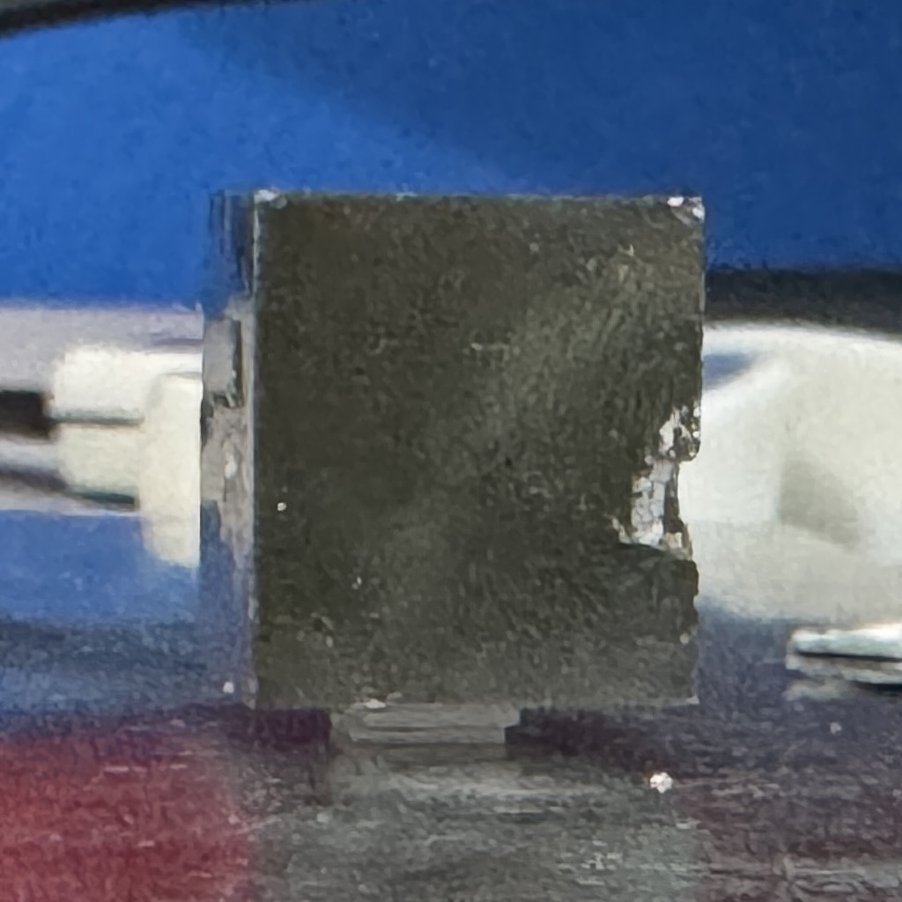 |

This wobbliness problem can appear anywhere in a mechanical system. It happens because two surfaces aren't held together by a strong force. To solve the problem, we need one of the following:
- large gravitational force
- magnetism
- chemical bonding (epoxy, solder)
- a spring clamp
- frictional force in a tightened screw, which is parallel to the contacting surfaces inside the screw

Everything but epoxy is a reversible connection mechanism. Solder can be undone and redone a small number of times, under the right conditions. The overarching problem is, if I mess up the layout of a mechanical system, there is no way to rearrange the existing parts. It would require buying the same individual parts all over again.

I can probably test certain subsystems for correct functioning before final assembly, such as a piezo stack. I can make the magnet force on the kinematic mount tunable, if both the top and bottom plates are made of steel. Many variables fall on a spectrum of tunability. But unfortunately, a few of them are probably 100% baked in ahead of time.

My task is to minimize the chance something goes wrong. Make as many connections as possible reversible, whether for practicality of storing the piece of hardware, or for correcting design errors. De-risk whenever possible. Accept the real possibility that I could run out of spare LiNbO3 piezo plates and face another 3-6 week lead time.

Too much fear of something going wrong will scare me away from trying anything.

## February 17, 2026

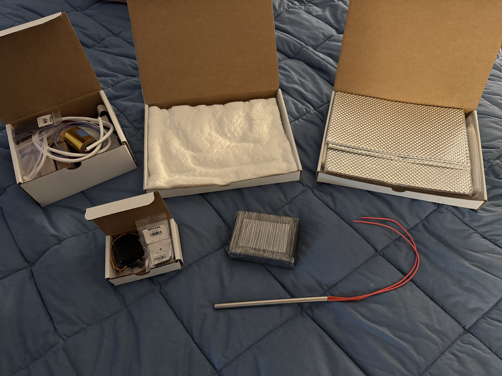

## February 27, 2026

[PCB BOM (Google Sheets)](https://docs.google.com/spreadsheets/d/11hSKUabHZscKTGl4hYCjbfahWj6xOX5oWkzyZ53yTAk/edit?usp=sharing)

## March 8, 2026

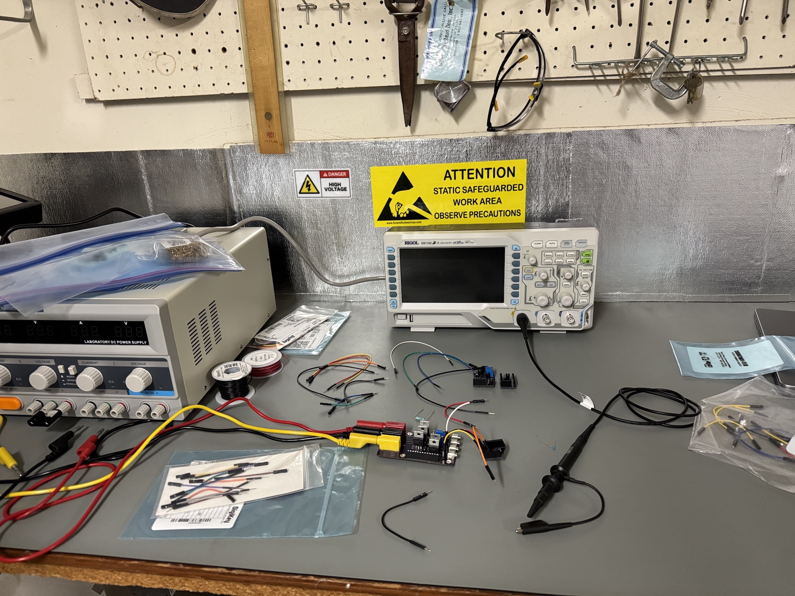

_Photograph of the lab setup for finding the bug._

I planned to test the frequency response of my transimpedance amplifiers today. However, TIA2 had 60 Hz interference with a magnitude of 2 V. While trying to understand the cause, I found a 2 V oscillation at 110 kHz in TIA1. This oscillation prevented me from measuring the 60 Hz interference in TIA1.

I have a theory about the cause. I accidentally reversed the supplies of TIA1. The regulators on the power board got extremely hot and I disconnected as soon as I noticed. Surprisingly, the op amp still worked after this event. But it could have caused unexplained degradations, just like ESD. Both the op amp and its bypass capacitors may have been affected.

I will test the 100 MΩ TIA on the Phase 0.1 board. If it doesn't show a 110 kHz oscillation, I will proceed with soldering a 2nd TIA1 from spare parts. In the process, I will also examine 60 Hz interference in the 330 MΩ TIA with the oscilloscope.

### Phase 0.1 Board

| Amplifier           | Osc. Freq. | Osc. Ampl. P-P |
| ------------------- | ---------: | -------------: |
| 100 MΩ              | 71 kHz     | 150 mV         |
| 330 MΩ              | 60 Hz      | 40 mV          |
| 330 MΩ              | >1 MHz     | 30 mV          |
| 330 MΩ (no limiter) | 180 kHz    | 30 V           |

I tested turning on the ±18 V linear power supply, just to see if it induced any noise from being nearby. There was no measurable effect.

## March 9, 2026

| Amplifier           | Osc. Freq. | Osc. Ampl. P-P |
| ------------------- | ---------: | -------------: |
| TIA1 (#1)           | 125 kHz    | 1.9 V          |
| TIA1 (#2)           | 125 kHz    | 1.9 V          |

I could not reduce the oscillation by increasing the C<sub>in</sub> capacitance between the two op amp terminals. I could reduce it marginally by placing large capacitors across R<sub>f</sub>.

| Capacitance | Osc. Freq. | Osc. Ampl. P-P |
| ----------: | ---------: | -------------: |
| ~0.1 pF     | 125 kHz    | 1.9 V          |
| 1 pF        | 125 kHz    | 380 mV         |
| 2 pF        | 125 kHz    | 210 mV         |
| 3 pF        | 125 kHz    | 150 mV         |
| 10 pF       | 125 kHz    | 50 mV          |
| 47 pF       | 125 kHz    | 15 mV          |

The ISO\_GND node is oscillating above oscilloscope case GND by 55 mV P-P at 125 kHz. But when I connect the second probe lead to the power board's GND, the oscillation vanishes. This oscillation was interfering with measurements of very small amplitude at 47 pF.

Just by being turned on, TIA1 injects a 60 mV oscillation into the PowerBoard GND, compared to the oscilloscope case GND. The oscillation doesn't happen when the power supply is turned off or TIA1 is disconnected.

C<sub>in</sub> of the op amp should be ~10 pF. The ground oscillation matches the oscillation after feedback when C<sub>f</sub> is ~10 pF. This is the point where noise gain is 1. At larger feedback capacitances, the noise gain shrinks.

I'll investigate the other TIA now and see whether it isn't horribly messed up. Perhaps OPA828 isn't a good chip, and the particular PCB layout choices for Phase 0.2 made it worse. I never noticed the problem much in Phase 0.1 because the 2nd-order LPF at 15 kHz greatly reduced the magnitude of the 71 kHz oscillation. However, the oscilloscope trace now will show a massive noise band of 150 mV.

---

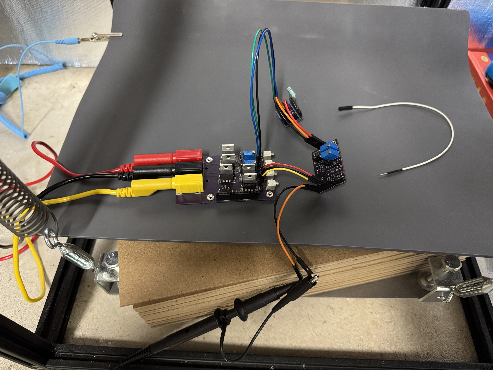

_Reproduction of the setup that caused concern about 60 Hz noise with TIA2._

I set up TIA2 and measured interference with the setup above.

| Amplifier           | Osc. Freq. | Osc. Ampl. P-P |
| ------------------- | ---------: | -------------: |
| TIA2                | 120 Hz     | 300 mV         |
| TIA2                | 125 kHz    | 400 mV         |
| TIA2                | 1.5 MHz    | 800 mV         |

This time, the 125 kHz oscillation does not appear when I try to measure the PowerBoard GND compared to the oscilloscope case. However, when I disconnect the GND clip of the probe, the 125 kHz oscillation's magnitude jumps to 1.0 V. This signal dominates the noise band, making it hard to see how 120 Hz noise changes when disconnecting the GND clip.

By placing a steel tray next to the boards, and bringing out a GND wire from the power board, I can decimate the magnitude of 125 kHz interference...

Will experiment with doing this for TIA1.

---

| Amplifier | Shield | Osc. Freq. | Osc. Ampl. P-P |
| --------- | ------ | ---------: | -------------: |
| TIA1 | none | 125 kHz | 1.9 V, 2.8 V |
| TIA1 | vibration isolation table | 125 kHz | 1.9 V, 2.8 V |
| TIA1 | reflow oven | 125 kHz | 1.9 V, 2.8 V |
| TIA2 | none | 120 Hz | 200&ndash;400 mV |
| TIA2 | none | 125 kHz | 200 mV |
| TIA2 | none | 1.5 MHz | 500 mV |
| TIA2 | vibration isolation table | 120 Hz | 20 mV |
| TIA2 | vibration isolation table | 125 kHz | 60 mV |
| TIA2 | vibration isolation table | 1.5 MHz | 100 mV |
| TIA2 | reflow oven | 125 kHz | 90 mV |

_Including a re-evaluation of TIA2 with no shield, to rule out the effect of some wires being shortened._

The oscillation in TIA1 cannot be suppressed with shielding. I don't even know what's going so wrong, but I can do STM with only TIA2. Fixing TIA1 will probably be a waste of time.

The only way to reduce noise even more, is probably a seamless shield with no hole larger than a specific wavelength. Attempts to enhance existing shielding will probably be a waste of time.

---

Let's examine the frequency response and then make more decisions about shielding. I might want to repurpose some pins used for connecting PowerBoard to MainBoard, so they serve as receptacles for AWG 22 wire.

---

| Amplifier | Configuration | Voltage | ADC Filtered | Current |
| --------- | ------------: | ------: | -----------: | ------: |
| 100 MΩ | Phase 0.1     | 150 mV | 7 mV   |
| 100 MΩ | Phase 0.2     | 2.8 V  | 40 mV  |
| 100 MΩ | 0.95 m shield | 2.8 V  | 40 mV  |
| 100 MΩ | 0.29 m shield | 2.8 V  | 40 mV  |
| 330 MΩ | Phase 0.1     | 40 mV  | 40 mV  |
| 1 GΩ   | no shield     | 500 mV | 200 mV |
| 1 GΩ   | 0.95 m shield | 150 mV | 20 mV  |
| 1 GΩ   | 0.29 m shield | 90 mV  | ~0 mV  |

| Amplifier | Configuration | Current | ADC Filtered |
| --------- | ------------: | ------: | -----------: |
| 100 MΩ | Phase 0.1     | 1.5 nA | 70 pA  |
| 100 MΩ | Phase 0.2     | 28 nA  | 400 pA |
| 100 MΩ | 0.95 m shield | 28 nA  | 400 pA |
| 100 MΩ | 0.29 m shield | 28 nA  | 400 pA |
| 330 MΩ | Phase 0.1     | 120 pA | 120 pA |
| 1 GΩ   | no shield     | 500 pA | 200 pA |
| 1 GΩ   | 0.95 m shield | 150 pA | 20 pA  |
| 1 GΩ   | 0.29 m shield | 90 pA  | ~0 pA  |

_From the dimensions of the aluminum T-slot frame, the largest aperture size in the vibration isolator is 0.95 m. The reflow oven's largest aperture size is 0.29 m._

---

[Tuning frequency response of 1 GΩ transimpedance amplifier (YouTube)](https://www.youtube.com/watch?v=ghyBSe6H7iE)

EMI after tuning frequency response:

| Amplifier | Shield | Osc. Freq. | Osc. Ampl. P-P |
| --------- | ------ | ---------: | -------------: |
| TIA2 | none | combined | 600 mV |
| TIA2 | none | 120 Hz | 200 mV |
| TIA2 | none | 125 kHz | 200 mV |
| TIA2 | none | 1.5 MHz | 300 mV |
| TIA2 | vibration isolation table | combined | 150 mV |
| TIA2 | vibration isolation table | 120 Hz | 30 mV |
| TIA2 | vibration isolation table | 125 kHz | 80 mV |
| TIA2 | vibration isolation table | 1.5 MHz | 80 mV |

---

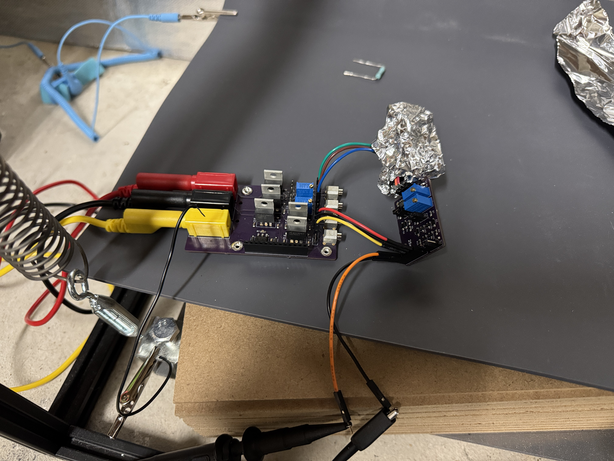

I created this small enclosure for the preamp out of aluminum foil, lined with parchment paper to prevent shorts from contacting the PCB. It serves as a functioning standalone enclosure, isolating noise to 150 mV regardless of whether the vibration isolator is electrically connected.

120 Hz and 1.5 MHz signals are, for the most part, annihilated. Only the 125 kHz signal remains. It was like this for the reflow oven as well (a much better shield than the vibration isolator). It is also quite interesting that the 125 kHz signal is approximately this magnitude (100&ndash;200 mV) both with and without shielding. That tells me the situation could be similar to TIA1. Not a good sign.

---

TIA1 on the Phase 0.1 board shows a 125 kHz, 2.8 V oscillation when wired to the wall power supply for Phase 0.2. 

Next tests:
- Isolated battery supply (again)
  - 69 kHz, 100 mV
- <s>Wall power supply, powering regulators from Phase 0.1 board</s>
- Changing wall power supply from ±18 V to ±27 V
  - ~100 kHz, 1.9 V
- Wall power supply, powering regulators from Phase 0.1 board (±18 V)
  - 70 kHz, 150 mV
- Wall power supply, powering regulators from Phase 0.1 board (±26 V)
  - 70 kHz, 150 mV
- Batteries, powering Phase 0.2 regulators
  - 140 kHz, 200 mV
- <s>Soldering 1N4007W diodes onto Phase 0.1 board</s>
- Removing the 1N4007W diodes from Phase 0.2, -15 V and 15 V regulators
  - 125 kHz, 1.9 V

It is very hard to set the midpoint of the voltage range on the oscilloscope display. I could measure a faint, <100 mV oscillation on the -15 V supply when TIA1 is plugged in and oscillating at 1.9 V. When I disconnect TIA1, the -15 V supply doesn't show a faint, barely-detectable ripple.

When I connected the oscilloscope probe between GND and -15 V in the wrong order, the oscilloscope showed weird signals and the regulators got extremely hot. I turned off the circuit immediately. This is the second instance of such an overcurrent event.

I need to double check once more that wall power can make TIA1 work cleanly, using the regulators on the Phase 0.1 board. Test TIA1 on the Phase 0.1 board and bring the supply lines out to Phase 0.2 TIA1. Also, try once more to disconnect the power supply from case GND to rule out a ground loop. And test whether the internal short between the master and slave power channels doesn't have weird quirks. Try changing the 0.1 uF output capacitor of a 15 V regulator to 1 uF. Perhaps the recommended 2.2 uF for the negative regulator was truly needed. But it's already 10:00 PM, so I'll have to pick up where I left off tomorrow.

## March 10, 2026

I found a solution to the problem! Add a large electrolytic capacitor to the output of the -15 V regulator.

Connecting the -15 V output to the Phase 0.1 board raises its output capacitance tremendously, from 1.1 uF to 4.1 uF. But even just an extra 1 uF mylar capacitor on a breadboard will decimate the oscillation. For better performance, polarized electrolytics do a better job with the same capacitance. 10 uF electrolytic is very good, and 100 uF is best. Positive supply doesn't show any change in behavior when attaching more capacitors.

| Capacitor Type | Capacitance | TIA1 Osc. P-P |
| -------------- | ----------: | ------------: |
| none           | none        | 2.8 V |
| mylar          | Phase 0.1 board | 100 mV |
| mylar          | 1 uF | 120 mV |
| electrolytic   | 1 uF | 70 mV |
| mylar          | 2.2 uF | 100 mV |
| electrolytic   | 2.2 uF | 50 mV |
| mylar          | 4.4 uF | 90 mV |
| electrolytic   | 4.7 uF | 40 mV |
| electrolytic   | 10 uF  | 35 mV |
| electrolytic   | 20 uF  | 30 mV |
| electrolytic   | 47 uF  | 30 mV |
| electrolytic   | 100 uF | 20 mV |
| mixed          | Phase 0.1 + 100 uF | 20 mV |
| electrolytic   | 200 uF | 15 mV |

I should also test the behavior of the 1 GΩ or 330 MΩ transimpedance amplifiers. They are more complex, because two negative regulators could mess things up.

---

EMI before modifying bypass capacitors, with power lines brought out to breadboard:

| Amplifier | Shield | Osc. Freq. | Osc. Ampl. P-P |
| --------- | ------ | ---------: | -------------: |
| TIA2 | none | combined | 2.0 V |
| TIA2 | none | 120 Hz | 1.0 V |
| TIA2 | none | 125 kHz | 500 mV |
| TIA2 | none | 1.5 MHz | 500 mV |
| TIA2 | vibration isolation table | combined | 600 mV |
| TIA2 | vibration isolation table | 120 Hz | TBD |
| TIA2 | vibration isolation table | 125 kHz | 400 mV |
| TIA2 | vibration isolation table | 1.5 MHz | TBD |

Adding a large bypass capacitor across the -5 V line did not help. But adding one across -15 V did. I'll measure the behavior of -15 V, then redo the wiring to reduce coupling into the preamp's power supplies.

Adding a 100 uF bypass capacitor across -15 V for OP37G:

| Amplifier | Shield | Osc. Freq. | Osc. Ampl. P-P |
| --------- | ------ | ---------: | -------------: |
| TIA2 | vibration isolation table | combined | 400 mV |
| TIA2 | vibration isolation table | 120 Hz | 300 mV |
| TIA2 | vibration isolation table | 125 kHz | 200 mV |
| TIA2 | vibration isolation table | 1.5 MHz | 50 mV |

---

New setup for wiring:

| Amplifier | Configuration | Osc. Freq. | Osc. Ampl. P-P |
| --------- | ------ | ---------: | -------------: |
| TIA2 |  | combined | 600 mV |
| TIA2 |  | 120 Hz | 200&ndash;400 mV |
| TIA2 |  | 125 kHz | 150 mV |
| TIA2 |  | 1.5 MHz | 300 mV |
| TIA2 | 0.95 m shield | combined | 150 mV |
| TIA2 | 0.95 m shield | 120 Hz | 30&ndash;60 mV |
| TIA2 | 0.95 m shield | 125 kHz | 100 mV |
| TIA2 | 0.95 m shield | 1.5 MHz | 50 mV |
| TIA2 | 0.95 m shield + 100 uF | combined | 90 mV |
| TIA2 | 0.95 m shield + 100 uF | 120 Hz | 35&ndash;70 mV |
| TIA2 | 0.95 m shield + 100 uF | 125 kHz | 40 mV |
| TIA2 | 0.95 m shield + 100 uF | 1.5 MHz | 60 mV |

Adding the foil shield back. Connecting the vibration isolator shield simultaneously does not reduce noise any further. This is a bit frustrating, as the vibration isolator shield alone has 150 mV total noise. This is less than the 300 mV total with the foil shield.

| Amplifier | Configuration | Osc. Freq. | Osc. Ampl. P-P |
| --------- | ------ | ---------: | -------------: |
| TIA2 | foil shield | combined | 300 mV |
| TIA2 | foil shield | 120 Hz | ~0 mV |
| TIA2 | foil shield | 125 kHz | 250 mV |
| TIA2 | foil shield | 1.5 MHz | ~0 mV |
| TIA2 | foil shield + 100 uF | combined | 80 mV |
| TIA2 | foil shield + 100 uF | 120 Hz | ~0 mV |
| TIA2 | foil shield + 100 uF | 125 kHz | ~0 mV |
| TIA2 | foil shield + 100 uF | 1.5 MHz | ~0 mV |

So the 125 kHz signal has vanished. Next, I will investigate how total noise and 125 kHz interference scale with capacitor size. Larger ones take a long time to discharge, and I fetched a 100 kΩ bleeder resistor for it.

| Amplifier | Capacitor | Osc. Freq. | Osc. Ampl. P-P |
| --------- | -----: | ---------: | -------------: |
| TIA2 | none | combined | 300 mV |
| TIA2 | none | 125 kHz | 250 mV |
| TIA2 | 10 nF mylar | combined | 300 mV |
| TIA2 | 10 nF mylar | 125 kHz | 250 mV |
| TIA2 | 47 nF mylar | combined | 150 mV |
| TIA2 | 47 nF mylar | 125 kHz | 130 mV |
| TIA2 | 100 nF mylar | combined | 90 mV |
| TIA2 | 100 nF mylar | 125 kHz | 90 mV |
| TIA2 | 200 nF mylar | combined | 80 mV |
| TIA2 | 200 nF mylar | 125 kHz | 50 mV |
| TIA2 | 1 uF mylar | combined | 70 mV |
| TIA2 | 1 uF mylar | 125 kHz | 30 mV |
| TIA2 | 1 uF electrolytic | combined | 80 mV |
| TIA2 | 1 uF electrolytic | 125 kHz | 40 mV |
| TIA2 | 4.4 uF mylar | combined | 70 mV |
| TIA2 | 4.4 uF mylar | 125 kHz | 20 mV |
| TIA2 | 100 uF electrolytic | combined | 90 mV |
| TIA2 | 100 uF electrolytic | 125 kHz | 20 mV |

I'm going to add a 10 uF, 0805 ceramic capacitor on top of the existing output capacitor for the -15 V regulator. I will not re-install the 1N4007W protection diodes. This choice has the least amount of effort to rework soldered parts. Then, I will test the performance of the new power board with TIA1 and TIA2.

As a recap, these are the P-P amplitudes of the 70&ndash;125 kHz oscillation:
- With 1 uF output capacitor across -15 V:
  - TIA1: 1.9 V or 2.8 V
  - TIA2: 150&ndash;250 mV (500 mV under rare conditions)
- With 2.1 uF combined unpolarized capacitance:
  - TIA1: 120 mV
  - TIA2: 30 mV
- With 3.1&ndash;4.1 uF from Phase 0.1 board connection:
  - TIA1: 100&ndash;150 mV
  - 330 MΩ: undetectable
- With 5.5 uF unpolarized:
  - TIA1: 90 mV
  - TIA2: 20 mV
- With 5.8&ndash;10.8 uF polarized:
  - TIA1: 35&ndash;40 mV
  - TIA2: 20 mV
- With 100 uF polarized:
  - TIA1: 15 mV
  - TIA2: 20 mV